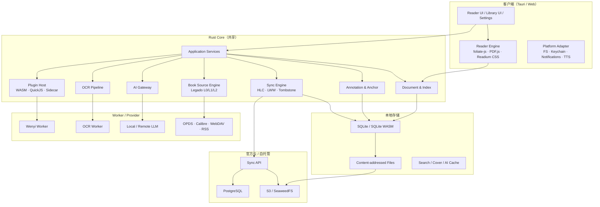

# 跨平台现代阅读器技术调研与架构设计报告

版本：v0.1  
调研截止：2026-09-13  
状态：Phase 0 完成；部分结论已被 ADR-0005 修订版与 ADR-0007 取代（见下方修订说明）  
工作名：Reader Platform（临时，名称不影响架构）

> **2026-09-16 修订说明。** 本报告已被部分取代，阅读时以 ADR 为准：
>
> - 项目决定**以 Readest 上游 fork 作为产品底座**，客户端 UI 不再自研，Rust Core 收窄为
>   上游缺失的能力（书源引擎、权限化插件宿主、Wenyi/OCR Job、自托管同步服务端）。
>   见 [ADR-0007](../decisions/ADR-0007-readest-as-product-base.md)。
> - 本报告的 §0.2 第 6 条、§4.2 第二条、§25.3、§25.4 第 1 条与该决定直接冲突，已失效。
> - 许可证以 [ADR-0005 修订版](../decisions/ADR-0005-license-strategy.md) 为准：**全项目
>   AGPL-3.0**，不再采用「客户端 Apache-2.0 + 服务端 AGPL-3.0」的分层方案。
> - 报告 §1.4 的候选名称仍待评审，不阻塞开发。

相关文档：

- [调研证据与来源清单](../research/EVIDENCE.md)
- [ADR-0001 跨平台架构](../decisions/ADR-0001-platform-architecture.md)
- [ADR-0002 Document Model 与渲染](../decisions/ADR-0002-document-model-and-rendering.md)
- [ADR-0003 插件运行时与平台策略](../decisions/ADR-0003-plugin-runtime-and-platform-policy.md)
- [ADR-0004 Sync Protocol](../decisions/ADR-0004-sync-protocol.md)
- [ADR-0005 许可证策略](../decisions/ADR-0005-license-strategy.md)
- [ADR-0006 Wenyi 集成方式](../decisions/ADR-0006-wenyi-integration.md)
- [ADR-0007 以 Readest 上游为产品底座](../decisions/ADR-0007-readest-as-product-base.md)

---

## 0. 结论摘要

### 0.1 推荐架构

推荐采用 **“共享 Rust Core + 共享 Web Reader UI + Tauri 2 原生壳 + 独立 Web/PWA 壳”**：

- **Reader UI / 排版层**：React + TypeScript，在 Tauri 的 WebView 与浏览器中使用同一套代码。
- **渲染引擎**：EPUB/FB2/MOBI/CBZ 以 [foliate-js](https://github.com/johnfactotum/foliate-js)（MIT）为主；PDF 使用 [PDF.js](https://github.com/mozilla/pdf.js)（Apache-2.0）；排版基线采用 [Readium CSS](https://github.com/readium/readium-css)（BSD-3-Clause）。
- **Core**：Rust workspace，负责书籍解析与索引、数据库、标注锚点、同步合并、插件宿主、AI Gateway、OCR Provider、书源引擎的宿主侧安全边界。
- **原生壳**：Tauri 2，覆盖 Windows、macOS、Linux、Android、iOS；Web 端单独构建静态 PWA，复用同一 UI 与 WASM 化 Core。
- **本地数据**：原生端 SQLite（rusqlite/sqlx）；Web 端 SQLite WASM/OPFS；全文检索先用 SQLite FTS5。
- **服务端**：Rust + Axum + PostgreSQL + S3 兼容对象存储，Docker Compose 一键自托管；官方云与自托管使用同一套 Sync Protocol。
- **AI/OCR/Wenyi**：全部作为 Provider/Worker 接入；移动端不内嵌 Python，不假设重任务能在 iOS 后台长期运行。
- **插件**：分层运行时。桌面端支持 WASM + QuickJS + Sidecar；Android 允许解释型/WASM 插件；iOS 只保证数据型/声明式插件与内置精选插件，避免下载可执行代码带来的商店合规风险。

### 0.2 必须先否定的原方案

以下做法看起来省事，但会破坏 5～10 年可维护性，建议明确否决：

1. **把所有格式转换成自有 Document Model 后丢弃原结构**：会永久丢失 EPUB 的 CSS、脚注、锚点、语言标记和固定版式信息。应保留原始文件，内部模型只做可重建索引。
2. **承诺 100% 兼容 Legado 书源**：Legado 书源依赖 Android WebView、Rhino/Java 桥、OkHttp Cookie、登录 UI 等平台能力，跨平台 100% 兼容在技术上不成立，在法律与安全上也不应承诺。
3. **把 Wenyi 作为 Python 库嵌进客户端**：iOS 不能运行 Python sidecar；长翻译任务也不适合移动端后台。应做 Job Runner + Sidecar/Remote Worker。
4. **插件热插拔任意可执行代码**：与 App Store 2.5.2 及 Google Play 动态代码政策冲突，且安全模型无法收敛。应做权限化、分层、平台差异化插件。
5. **默认把所有书籍文件上传云端**：版权、成本、隐私和冲突都会失控。书籍文件同步必须是可选能力，默认只同步元数据与阅读数据。
6. ~~**以某个现成项目为“底座”直接改造**：Readest/KOReader/Legado 分别为 AGPL/GPL，直接改造会把许可证、平台历史和架构债务一起继承。应借鉴设计，不复制受限代码。~~
   **【已失效】** 本项目现在明确采用该方案，见 [ADR-0007](../decisions/ADR-0007-readest-as-product-base.md)。当时的理由是不继承 AGPL 义务；ADR-0005 修订为全项目 AGPL-3.0 后该理由不再成立，剩余的上游追踪成本已在新 ADR 中记录并接受。
7. **让登录、云服务或在线校验成为阅读前提**：这会直接违背 Local-first 和离线阅读目标。

### 0.3 关键需求冲突与取舍

| 问题 | 原因 | 影响 | 方案 A | 方案 B | 推荐 |
| --- | --- | --- | --- | --- | --- |
| 六端共用一套 UI，同时要求专业排版与无障碍 | Flutter/KMP 跨端一致性强，但 Web 文本选择、DOM 标注、屏幕阅读器生态弱；WebView 方案跨端一致但依赖系统 WebView | 渲染质量、批注精度、无障碍 | Flutter + Rust Core | React UI + Tauri 2 + Web/PWA | **B**：阅读器的排版、选区、标注本质上是 DOM/CSS 问题，Web 引擎是唯一能在六端共享同一套锚点语义的路线 |
| 插件一等公民 vs iOS/Android 商店合规 | Apple 2.5.2 禁止下载会改变功能的代码；Google Play 禁止下载 dex/JAR/.so，但允许 VM/解释器代码 | 插件市场与平台能力 | 所有端同一套可执行插件 | 平台分级插件能力 | **B**：桌面/Android 提供强插件，iOS 提供声明式/内置/远程能力 |
| Legado 书源兼容 vs 安全与可维护性 | 书源规则包含任意 JS、WebView、Cookie 与 Android API | 兼容范围、沙箱、法律风险 | 追求 100% 兼容 | 兼容分级 + 受限运行时 | **B**：实现 L0/L1 高覆盖兼容，L2 明确受限，L3 不承诺 |
| EPUB 信息无损 vs 统一数据模型 | 任何“先转成内部格式再阅读”的方案都会丢信息 | 排版、脚注、批注重新定位 | 全量转内部模型 | 原文件 + 派生索引 | **B**：原文件不可变，索引可重建 |
| 移动端 AI/OCR/翻译开箱即用 vs 端侧算力与后台限制 | iOS 后台任务时间有限，移动端跑 OCR/LLM 代价高 | 体验与耗电 | 客户端本地全跑 | Worker/Sidecar/云端可选 | **B**：默认轻量端侧，重任务交给桌面 Worker 或自托管/官方云 |
| Local-first vs 多设备同步 | 无中心时钟，设备离线时间长 | 冲突解决与数据丢失风险 | 简单 LWW | HLC + 字段级 LWW + 墓碑 + 锚点重定位 | **B**：进度用字段级 LWW，标注额外做锚点与合并策略 |
| 长期开源 + 官方云付费 vs 许可证 | AGPL/GPL 代码会限制闭源客户端与商店分发 | 商业化与许可证合规 | 全项目 AGPL | 宽松客户端 + AGPL 服务端 | **B**：客户端/核心 Apache-2.0，服务端 AGPL-3.0；GPL/AGPL 项目只参考设计 |
| 性能目标 vs 快速做出 Demo | 大 EPUB/PDF 与 10,000 章 TXT 需要流式索引 | 启动、内存、搜索 | 先全量加载 | 懒加载 + 索引 + 缓存 | **B**：从第一天按流式设计，MVP 就做性能基线 |

---

## 1. 项目定位

### 1.1 一句话定位

做一个 **以阅读器为核心、Local-first、跨平台、插件化，支持网络书源、AI、OCR、翻译、批注，以及官方云/自托管同步的现代阅读平台**。

它不是 EPUB 阅读器的换皮，不是 Legado 的跨平台移植，也不是 Wenyi 的 GUI。核心资产是：

1. **阅读体验**：排版、字体、翻页、批注、跨设备连续性。
2. **开放协议**：Document/Annotation/Sync/Plugin/Provider 协议。
3. **生态**：书源、AI Provider、OCR Provider、词典、TTS、同步后端、插件。

### 1.2 目标用户

- 本地电子书重度读者：EPUB/PDF/TXT，重视排版、批注、导出与隐私。
- 网络小说读者：需要书源、目录更新、离线缓存、TTS。
- 多设备用户：手机/平板/电脑/网页之间连续阅读。
- AI 辅助阅读用户：翻译、词汇、章节总结、全书分析、双语阅读。
- 漫画/扫描件用户：OCR、翻译、气泡文本覆盖。
- 自托管/隐私用户：自己部署同步服务，或纯本地不登录。
- 插件开发者：书源、OCR、AI、词典、主题、同步 Provider。

### 1.3 非目标（至少前两年）

- 不做内容平台，不内置盗版书库或书源。
- 不做电子书商店和支付（架构预留 Entitlement，不实现支付）。
- 不做实时协作编辑（可预留 CRDT 扩展点）。
- 不做社交动态和推荐算法。
- 不追求所有平台的 E-Ink 专用优化；先支持 Android E-Ink 设备与高对比/无动画模式。
- 不追求 Legado 的 100% 规则兼容。

### 1.4 候选名称

仅作为工作名候选，正式使用前必须做商标与域名检索：

| 候选 | 含义 | 风险 |
| --- | --- | --- |
| Lumen / 明阅 | 光、清晰、照明 | Lumen 商标可能被占用 |
| 墨舟 / MoReader | 墨水与航行 | 中文名较常见，需检索 |
| Aura Reader | 阅读氛围 | 英文常见词，商标风险中 |
| Ostracon | 古代书写陶片 | 独特但难记 |
| 汐读 / TideRead | 潮汐式阅读节奏 | 需检索 |

名称评审不应阻塞架构设计。

---

## 2. 用户场景

### 场景 A：纯本地阅读（无账号、无网络）

导入 EPUB/PDF/TXT → 书架 → 阅读 → 调整字体/主题/翻页 → 划线/批注 → 本地搜索 → 导出笔记。关闭网络后全部功能可用。

### 场景 B：多设备连续阅读

手机读到第 10 章 80%，电脑打开同一本书，当前进度、阅读位置、书签、划线、批注、阅读设置、统计同步。书籍文件是否上传由用户按书决定。

### 场景 C：网络书源阅读

导入用户自己的书源 → 搜索/发现 → 详情 → 加入书架 → 目录 → 正文 → 离线缓存 → 更新目录 → TTS。书源默认不被信任，网络与文件访问受权限控制。

### 场景 D：AI 翻译与双语阅读

打开外文 EPUB → 选择“AI 翻译” → 选择语言与 Provider → Wenyi Pipeline → 生成独立译文 Edition → 原文/译文/双语/段落对照/词汇表。原书文件保持不变。

### 场景 E：OCR 与漫画翻译

截图或导入漫画页 → OCR Provider → 文本与坐标 → AI 翻译 → 覆盖气泡 → 人工校正 → 保存为页级注释，不修改原图。

### 场景 F：自托管

`docker compose up -d` 启动 Sync API + PostgreSQL + 对象存储 → 客户端填写服务器地址 → 登录或使用设备令牌 → 多设备同步。服务器宕机不影响本地阅读。

### 场景 G：插件开发者

开发者通过 Manifest 声明 `network`、`book.read`、`annotation.write`、`ai.request` 等权限；宿主在安装时展示权限清单，并在运行时强制拦截越权调用。

---

## 3. 竞品分析

### 3.1 功能矩阵

证据等级：★ 官方页面/官方文档；☆ 公开资料或产品体验，需在产品迭代时复核。

| 产品 | 平台 | 阅读与排版 | 笔记/批注 | 统计 | AI/辅助 | 字体与主题 | 同步 | 书库/书源 | 社交 | 可借鉴点 |
| --- | --- | --- | --- | --- | --- | --- | --- | --- | --- | --- |
| 微信读书 ★ | Android/iOS/Web/小程序 | 沉浸式、翻页、听书 | 划线、想法、书签 | 强 | AI 问书等（版本变化）☆ | 中 | 强 | 官方书库 | 强 | 阅读沉浸感、时长统计、书摘分享 |
| Apple Books ★ | iOS/iPadOS/macOS | 精良、PDF、听书 | 高亮、笔记 | 弱 | 系统朗读、词典 | 中 | iCloud | 商店/导入 | 弱 | Apple Pencil、系统集成、无障碍 |
| Kindle ★ | 硬件/移动/桌面 | 成熟、X-Ray、Word Wise | 高亮、笔记、Vocabulary Builder | 中 | X-Ray、翻译、生词 | 中 | Whispersync | 商店/发送到 Kindle | Goodreads | 实体识别、生词本、跨设备进度 |
| Google Play Books ★ | Android/iOS/Web | Web 阅读器成熟 | 笔记、书签 | 弱 | 翻译、朗读、词典 | 中 | Google 账号 | 商店/上传 PDF/EPUB | 弱 | 自上传与转换、Web 阅读器 |
| Kobo ★ | 硬件/移动/桌面 | E-Ink 排版可调 | 笔记、划线 | 中 | 词典、翻译 | 强 | Kobo 云 | Kobo/OverDrive | 中 | 字体/行距/边距控制、E-Ink |
| PocketBook ★ | 硬件/移动 | 格式多、可调 | 笔记、词典 | 中 | 词典、TTS | 强 | 云 | 商店 | 弱 | 格式广度、词典与 TTS |
| 多看阅读 ★ | Android/iOS/Kindle | 中文排版精致 | 笔记、划线 | 中 | 词典 | 强 | 云 | 商店 | 弱 | 中文排版、字体设计、版式 |
| 得到阅读 ★ | Android/iOS/桌面 | 电子书+听书 | 笔记、导出 | 中 | 知识库/AI 辅助 | 中 | 云 | 得到内容 | 弱 | 学习闭环、笔记导出 |
| 网易蜗牛读书 ★ | Android/iOS | 简洁、时间付费 | 笔记、书评 | 中 | 无 | 中 | 云 | 官方书库 | 领读/书评 | 阅读时间产品化、书单策展 |

### 3.2 对竞品的结论

1. **沉浸式阅读体验是入场券，不是差异化**。差异化在排版深度、批注数据质量、跨设备连续性和开放生态。
2. **阅读统计必须本地优先**。微信读书的社交化统计不适合直接照搬；我们只保留私密统计，社交作为未来独立模块。
3. **商业产品的 AI 功能通常绑定自家内容与账号**。我们的优势应是 Provider 中立、可自托管、可换模型、可离线。
4. **字体与排版是中文阅读器的核心体验**。多看阅读和 Kobo 的排版控制值得研究，但不应把设置做成“几十个难懂选项”；应提供预设 + 高级模式。
5. **Apple Books/Kindle/Google Play Books 的封闭生态无法复制，也不应复制**。应学习其稳定性、无障碍与实体识别（X-Ray 类）能力。

证据说明：微信读书与 Google Play Books 的能力来自官方页面描述；Apple Books 来自官方产品页；Kindle/Kobo/PocketBook/多看/得到/蜗牛的能力来自官方站点与公开资料，细节随版本变化。所有竞品结论只用于功能取舍，不做代码或资源复用。

---

## 4. 开源项目全景分析

### 4.1 项目清单与可复用性

| 项目 | 许可证 | 当前状态（2026-09-13） | 技术栈 | 可复用性 | 结论 |
| --- | --- | --- | --- | --- | --- |
| [Wenyi](https://github.com/BigDawnGhost/wenyi) | MIT | v0.7.0；最近提交 2026-09-10 | Python 3.10+/CLI | 可作为独立 Worker 集成 | **推荐集成**，不内嵌 |
| [Legado 官方仓库](https://github.com/gedoor/legado) | GPL-3.0（历史） | 官方 GitHub 仅剩维权公告，源码下架 | Android/Kotlin | 不可作为代码来源 | **仅参考协议与规则语义** |
| [Read3.0 分支](https://github.com/yudonw/Read3.0) | GPL-3.0 | 2025-06-26 快照 | Android/Kotlin/Rhino/Jsoup | 仅研究书源规则与数据模型 | **不复制代码** |
| [Readest](https://github.com/readest/readest) | AGPL-3.0 | v0.12.8；最近提交 2026-09-11 | Tauri 2/Next.js/foliate-js/Turso | 仅参考产品与同步设计 | **不放入宽松许可客户端** |
| [KOReader](https://github.com/koreader/koreader) | AGPL-3.0 | v2026.07.1；最近提交 2026-09-13 | Lua/C++/CREngine/MuPDF | 仅参考排版、手势、统计 | **不复制代码** |
| [foliate-js](https://github.com/johnfactotum/foliate-js) | MIT | 无正式 Release；最近提交 2026-05-01 | 原生 ES Modules | EPUB/MOBI/FB2/CBZ/PDF 渲染 | **推荐，固定版本 + 适配层** |
| [epub.js](https://github.com/futurepress/epub.js) | BSD-3-Clause | 最近提交 2026-03-23 | JavaScript | 老牌但 API 与性能落后 | 不推荐作为主引擎 |
| [Readium CSS](https://github.com/readium/readium-css) | BSD-3-Clause | 活跃 | CSS/PostCSS | 排版与主题基线 | **推荐** |
| [Readium Kotlin/Swift Toolkit](https://readium.org/) | BSD-3-Clause | 活跃 | Kotlin/Swift | 原生 EPUB/LCP | 仅参考与兼容测试 |
| [PDF.js](https://github.com/mozilla/pdf.js) | Apache-2.0 | 活跃 | JavaScript | PDF 渲染与文本层 | **推荐** |
| [Calibre](https://github.com/calibre/calibre) | GPL-3.0 | 活跃 | Python/Qt | 转换、元数据、Content Server | 仅作为用户可选外部工具 |
| [Calibre-Web](https://github.com/janeczku/calibre-web) | GPL-3.0 | 活跃 | Python | OPDS/书库 Web | 仅参考 OPDS 交互 |
| [Umi-OCR](https://github.com/hiroi-sora/Umi-OCR) | MIT | Windows/Linux x64 | Python/Qt | HTTP/CLI OCR | **Sidecar 适配器** |
| [webpub-manifest](https://github.com/readium/webpub-manifest) | BSD-3-Clause | 活跃 | JSON | 元数据模型 | **参考/兼容** |

### 4.2 结论

- 可以进入我们项目的宽松许可代码：foliate-js、PDF.js、Readium CSS、Readium Manifest（BSD/MIT/Apache）。
- ~~只能参考设计、不能复制代码：Readest、KOReader、Legado、Calibre、Calibre-Web。~~
  **【已失效】** 本项目为 AGPL-3.0，Readest（AGPL-3.0）的代码可直接复用，并已作为产品底座
  （[ADR-0007](../decisions/ADR-0007-readest-as-product-base.md)）。KOReader 同为 AGPL-3.0，
  复用方式逐项评估；Legado、Calibre、Calibre-Web 为 GPL-3.0，与 AGPL-3.0 的组合义务需单独
  评估（见 §25）。
- 以独立进程集成：Wenyi、Umi-OCR、MinerU、BabelDOC、Calibre CLI。
- 所有第三方依赖必须进入 SBOM，并在 CI 中做许可证扫描。

---

## 5. Wenyi 分析

### 5.1 已验证事实

Wenyi 是一个 Python 3.10+ 的整本书翻译工具，MIT 许可证，v0.7.0。它的定位不是阅读器，而是 **长文本翻译流水线**。官方 README 与 docs 明确说明：

- 整书预扫描：章节 digest + 全书 synopsis，并注入每个翻译批次。
- 实时术语表：抽取人名、地名、组织、术语、固定表达，检测冲突。
- 多阶段质量：翻译 → 可选润色 → 证据驱动的全书 Review → 可选 Autofix。
- 可恢复：批次级 checkpoint、章节状态、原子写入；中断后用同一命令继续。
- Provider：DeepSeek、OpenAI、OpenRouter、OrcaRouter、Gemini、Ollama、vLLM、任意 OpenAI-compatible，另有离线 fake。
- 模型路由：strong/cheap/fast 三档 + 按 operation 路由 + quotas/budget/usage ledger。
- 输出：EPUB（单语/双语）、TXT、HTML、Markdown、DOCX、SRT；PDF 输入默认 MinerU，另有 BabelDOC bridge。
- EPUB 保留：尝试把译文写回原 XHTML 模板，保留样式、图片、目录、锚点；双语版保留原文。

### 5.2 状态与恢复机制

`runstore.py` 暴露了稳定的运行目录结构：

```text
state/<book>/targets/<target-language>/
├── manifest.json          # 书籍元数据与章节状态
├── chapters/chN.json      # 分段原文、译文、润色前文本
├── source/                # 预处理缓存
├── context.json           # 滚动上下文
├── analysis.json          # 全书风格分析
├── glossary.db            # SQLite 术语表与冲突
├── usage.json             # token/请求统计
├── events.jsonl           # 追加式事件日志
├── report.json            # 质量报告
├── annotation_contexts.json
└── reviews/<run>/         # Review/Autofix 结果、rounds、autofix/index.json
```

每批次立即持久化，manifest-last 初始化，临时文件 + `os.replace` 原子替换。这是做 Job 状态展示与断点恢复的理想基础。

### 5.3 集成设计：Wenyi Integration Layer

**推荐做法**：Wenyi 作为独立 Worker（本机 sidecar 或远程容器），通过 Job 协议通信。

```text
Reader UI
  → 创建 TranslationJob
Job Service (Core)
  → JSON-RPC / HTTP
Wenyi Worker (固定版本 Python 环境)
  → trans-novel CLI 或受控 Python API
state/<book>/targets/<lang>/
  → manifest.json / events.jsonl / report.json
Job 进度回传
  → assemble 输出
Translated Edition (新文件，不覆盖原书)
  → Reader 打开译文/双语/对照
```

Job 状态机：

```text
queued → preparing → analyzing → translating → polishing
       → reviewing → assembling → done
       ↘ failed / paused / cancelled
```

能力映射：

| Reader 功能 | Wenyi 能力 | 集成方式 |
| --- | --- | --- |
| 全文翻译 | `prepare` + `translate` + `assemble` | Job |
| 单章重译 | `translate --chapter N` | Job（v0.7.0 支持） |
| 单段重译 | 无公开 CLI 参数 | **受限**：需要上游增加 `--segment`，或由 Integration Layer 对章节 JSON 做受校验的编辑后重跑；不能假装已支持 |
| 续跑/中断 | 同命令重跑，跳过已完成批次 | Job 重启 |
| 术语表 | `glossary.db` + `glossary list/conflicts` | 导入为 Book Glossary，可编辑 |
| 质量报告 | `report.json` + Review 目录 | 展示为质量面板 |
| 双语 EPUB | `--bilingual` | 生成独立 Edition |
| 原文对照 | 双语 EPUB 或按 segment 映射 | 阅读器 paragraph alignment |
| 原文保护 | Wenyi 不修改输入文件 | Core 层再做内容哈希校验 |

### 5.4 必须明确的限制

1. **Wenyi 不是稳定库 API**。它的公开接口是 CLI，内部模块可能变化。集成层必须固定版本，并只依赖 CLI、`manifest.json`、`events.jsonl`、`report.json` 等有文档的状态文件；不得把私有 Python 函数当作稳定 API。
2. **单段重译不是 v0.7.0 的一等能力**。需要上游贡献，或在 Integration Layer 中实现受 schema 版本保护的状态操作。
3. **EPUB 保留是“尽力而为”**。复杂 CSS、脚本化 EPUB、固定版式、部分脚注/链接可能无法完全保真。集成层必须对比原文与译文的资源清单，并提示“保留度风险”。
4. **PDF 路径有额外许可证/外部依赖**：MinerU 是 Apache-2.0 + 附加商业条款（MAU > 1 亿或月收入 > 2000 万美元需商业许可；在线服务需显著标注使用了 MinerU）；BabelDOC bridge 是 AGPL 独立进程。若官方云提供 PDF 翻译，必须逐项合规。
5. **移动端不可直接运行**。iOS 不运行 Python sidecar；Android 可以但代价高。手机端只做 Job 控制与阅读；重任务交给桌面 Worker、自托管服务器或官方云。
6. **术语表与译文是资产**。应把 Glossary、译文 Edition、Review 报告纳入同步/导出范围，而不是只保留最终 EPUB。

---

## 6. Legado / 阅读 3.0 分析

### 6.1 当前法律与可用性风险

截至 2026-09-13，`gedoor/legado` 官方 GitHub 仓库只剩下维权公告，说明项目因侵权相关问题下架并删除内容。`yudonw/Read3.0` 是 2025-06-26 的 GPL-3.0 快照，可用来研究书源规则语义，但不能作为长期依赖。

结论：

- 不在核心中硬编码任何书源或内容站点。
- 不提供 Z-Library 等内容服务的抓取能力。
- 书源只做用户自配置的 Provider/Adapter。
- 必须提供举报、禁用、导入时的风险提示和来源审计。

### 6.2 BookSource 数据模型

从 `BookSource.kt` 与规则实体可以确认，Legado 书源是一个 JSON 对象，包含：

- 基础：`bookSourceUrl`（主键）、`bookSourceName`、`bookSourceGroup`、`bookSourceType`（0 文本、1 音频、2 图片、3 文件）、`bookUrlPattern`、`enabled`、`enabledExplore`、`customOrder`、`weight`。
- 网络：`header`、`loginUrl`、`loginUi`、`loginCheckJs`、`coverDecodeJs`、`enabledCookieJar`、`concurrentRate`。
- 规则：`searchUrl`、`exploreUrl`、`exploreScreen`、`ruleSearch`、`ruleExplore`、`ruleBookInfo`、`ruleToc`、`ruleContent`、`ruleReview`。
- JS：`jsLib`、`variableComment`。

规则字段：

| 规则 | 关键字段 |
| --- | --- |
| `ruleSearch` | `checkKeyWord`、`bookList`、`name`、`author`、`intro`、`kind`、`lastChapter`、`updateTime`、`bookUrl`、`coverUrl`、`wordCount` |
| `ruleExplore` | `bookList`、`name`、`author`、`intro`、`kind`、`lastChapter`、`updateTime`、`bookUrl`、`coverUrl`、`wordCount` |
| `ruleBookInfo` | `init`、`name`、`author`、`intro`、`kind`、`lastChapter`、`updateTime`、`coverUrl`、`tocUrl`、`wordCount`、`canReName`、`downloadUrls` |
| `ruleToc` | `preUpdateJs`、`chapterList`、`chapterName`、`chapterUrl`、`formatJs`、`isVolume`、`isVip`、`isPay`、`updateTime`、`nextTocUrl` |
| `ruleContent` | `content`、`title`、`nextContentUrl`、`webJs`、`sourceRegex`、`replaceRegex`、`imageStyle`、`imageDecode`、`payAction` |

### 6.3 规则引擎语义

Legado 的规则不是单一选择器，而是一门小型 DSL：

- 模式前缀：`@CSS:`、`@XPath:`、`@Json:`、`@@`（默认/CSS 语义）、`/`（自动识别 XPath）、`$`（自动识别 JSONPath）。
- 组合：`&&`（合并所有结果）、`||`（取第一个非空结果）、`%%`（逐项交错合并，用于列表配对）。
- 替换：`##regex##replacement`，第四个 `##` 表示只替换第一个。
- 变量：`@get:{...}`、`@put:{...}`、`{{ JS 表达式 }}`。
- JS：`<js>...</js>` 或 `@js:`，可访问 `java`、`source`、`book`、`cookie`、`cache`、`ajax` 等宿主对象。
- URL 规则：`url,{ "method": "POST", "headers": {...}, "body": "...", "charset": "gbk", "retry": 2, "webView": true, "webJs": "...", "js": "..." }`。
- 分页与关键字：`<...>` 页数选择、`searchKey`/`key`、`page` 等变量替换。

### 6.4 兼容分级

| 级别 | 范围 | 目标 |
| --- | --- | --- |
| L0 声明式 | 搜索/发现 URL、CSS/Jsoup、XPath、JSONPath、正则、`##` 替换、`&&`/`\|\|`/`%%`、`@get`、分页 | 高覆盖，跨端可用，纯沙箱 |
| L1 轻量表达式 | `{{ }}` 数学/字符串处理、Base64/URL 编解码、简单 `@js:` 转换、受限 JS 沙箱 | 覆盖常见动态规则 |
| L2 高级兼容 | `java.ajax`/`java.post`、Cookie、WebView、登录、图片解密、source/book 对象 | 桌面/Android 可选，明确权限与风险；iOS 不提供 |
| L3 不承诺 | 依赖 Android 私有 API、任意文件访问、进程执行、未声明网络目标 | 拒绝或隔离，不保证兼容 |

**结论：不能承诺 100% 兼容。** 正确目标是：L0/L1 覆盖大多数规则；L2 作为高危增强模式；L3 直接拒绝。所有不支持的规则必须在导入/调试时给出具体原因，而不是静默失败。

### 6.5 书源安全模型

- 每个书源独立 Cookie/Header/变量空间，默认不共享。
- 网络默认只允许声明域名及其子域；重定向逐跳校验；禁止访问本机、内网、云元数据地址（SSRF 防护）。
- 响应体大小、超时、重定向次数、并发、JS CPU/内存全部有上限。
- JS 运行时无 `fs`、无进程、无原生桥；`net` 只能通过宿主代理并按权限发请求。
- 书源不能读取用户 API Key、Cookie、文件系统、标注数据库。
- 导入前展示：权限、域名、是否使用 JS/WebView/登录、风险等级。

---

## 7. Readest 分析

### 7.1 已验证架构

Readest 是一个已商业化的开源阅读器，AGPL-3.0，v0.12.8。其架构事实：

- Tauri v2 + Next.js 16 + TypeScript；一个代码库产出桌面、移动和 Web。
- Rust 侧做原生 EPUB/MOBI 解析快路径、封面缩略图、文件访问、Tauri 插件。
- 渲染层使用其 fork 的 `foliate-js`（workspace package），PDF 使用 `pdfjs-dist`。
- 本地数据库使用 Turso（SQLite 系）的 WASM 与原生插件。
- 云端依赖 Supabase Auth、S3 兼容存储、Stripe、Cloudflare（Web 部署）。
- Linux 提供 CEF 构建开关（`--no-default-features --features cef`），说明 WebKitGTK 在 Linux 上存在兼容/性能压力。
- Tauri 配置中 Android minSdk 26、iOS minimum 16.4。

### 7.2 功能事实

官方 README 列出的已实现能力包括：EPUB/PDF/MOBI/KF8/FB2/CBZ/TXT/MD、滚动/翻页、全文搜索、批注/高亮/书签、词典/Wikipedia/Yomitan、并行阅读、字体与主题、代码高亮、OPDS/Calibre、网页剪藏、DeepL/Yandex 翻译、有声书、TTS、Read-Along、跨平台同步、KOSync、无障碍、阅读标尺/逐段模式/速读。

README 同时把 **AI 总结** 列为“Building”，把 **高级阅读统计** 与 **手写批注** 列为计划。其依赖中有 `ai`、`@ai-sdk/openai-compatible`、`assistant-ui`，说明 AI 基础设施已存在，但不是所有目标功能都已完成。

### 7.3 同步设计（最值得学习的部分）

Readest 的 `crdt.README.md` 给出了一个成熟的同步原语：

- HLC（Hybrid Logical Clock）字符串：`physicalMs-counter-deviceId`，字典序即时间序。
- 每个字段包成 `{ v, t, s }`，字段级 LWW。
- 删除使用墓碑 `deleted_at_ts`，**字段写入不能复活墓碑**，复活必须使用显式 reincarnation token。
- `mergeReplica` 满足交换律、结合律、幂等性；服务端有对应的 Postgres merge 函数。
- `replicas` 是多态表，`kind` 允许字典、字体、纹理、OPDS、ABS Server、settings 等；单行 JSON 限制 64 KiB、最多 64 字段。
- 加密字段在 envelope 层透明叠加，CRDT 只看到密文。

这套模型可以借鉴到我们的 Settings、Collection、Dictionary、Source、Font 元数据同步。标注与笔记还需要更细的锚点与合并策略。

### 7.4 值得借鉴与不适合照搬

值得借鉴：

- “同一 UI 代码 + Tauri 壳 + Web 壳”的跨端路线。
- Rust 侧解析大文件、WebView 侧负责排版与交互的分工。
- HLC + 字段级 LWW + 墓碑 + 加密 envelope。
- 本地 SQLite/WASM + 云对象存储的分层。
- 与 KOReader/KOSync 互操作。
- OPDS/Calibre 作为 Library Provider。

不适合照搬：

- AGPL 代码不能进入宽松许可客户端。
- 对 Supabase/Stripe/Cloudflare 的强耦合不适合自托管优先。
- Next.js 同时服务桌面应用会增加构建/运行时复杂度；我们推荐静态 SPA，把 SSR 留给营销/分享页。
- 同步模型仍以 LWW 为主，不足以处理标注锚点漂移和笔记并发编辑，需要扩展。

---

## 8. KOReader 分析

### 8.1 已验证能力

KOReader 是 E-Ink 优先的文档阅读器，AGPL-3.0，v2026.07.1。支持固定版式（PDF/DjVu/CBT/CBZ）与可重排格式（EPUB/FB2/MOBI/DOC/RTF/HTML/CHM/TXT），内置 K2pdfopt 重排扫描 PDF/DjVu，支持 Calibre、OPDS、Wallabag、Wikipedia、StarDict、RSS、FTP、SSH、OTA 更新。

它的阅读器模块非常细粒度，例如：

```text
frontend/apps/reader/modules/
├── readertypeset.lua      # 排版
├── readerfont.lua         # 字体
├── readertypography.lua   # 标点/连字/断词
├── readerstyletweak.lua   # 样式覆盖
├── readercoptlistener.lua # CREngine 选项
├── readerpaging.lua       # 分页
├── readerrolling.lua      # 滚动
├── readerscrolling.lua
├── readerhighlight.lua    # 高亮
├── readerannotation.lua   # 注释
├── readerbookmark.lua
├── readersearch.lua
├── readertoc.lua
├── readergoto.lua
└── ...
```

统计插件使用 SQLite（`statistics.sqlite3`），记录阅读时长、页数、高亮/笔记数量，并支持合并/同步。

### 8.2 插件系统事实

KOReader 插件是 `.koplugin` 目录 + `_meta.lua` + `main.lua`，从 `plugins/` 或额外路径加载。插件可以直接 `require` KOReader 内部模块，拥有与主程序几乎相同的权限；`HandlerSandbox` 只是错误捕获和堆栈日志，不是安全沙箱。

这说明：

- KOReader 插件生态在“可扩展性”上成功。
- 它的安全模型不适合现代插件市场。
- 我们应借鉴其模块边界与事件机制，但不借鉴“无权限 Lua 插件”。

### 8.3 对项目的启示

1. 排版、字体、断词、样式覆盖应拆成独立模块，便于测试与平台适配。
2. E-Ink 模式需要独立 profile：无动画/少动画、高对比、灰度、局部刷新、手势可关闭。
3. 阅读统计应使用本地 SQLite，支持导入/合并/导出。
4. 插件必须比 KOReader 更严格：Manifest + 权限 + 沙箱 + 签名 + 平台策略。
5. KOReader 的 AGPL 代码不能进入我们的宽松许可客户端，只能参考模块划分与交互。

---

## 9. 阅读引擎分析

### 9.1 候选引擎对比

| 引擎 | 许可证 | 覆盖格式 | 优点 | 缺点 | 结论 |
| --- | --- | --- | --- | --- | --- |
| foliate-js | MIT | EPUB/MOBI/KF8/FB2/CBZ/PDF(实验) | 原生 ES Modules、无构建步骤、模块化、不需整书载入内存、支持 CFI/搜索/分页/重叠层 | API 未稳定、无正式 Release、PDF 能力弱 | **可重排内容主引擎** |
| epub.js | BSD-3 | EPUB | 生态老牌、API 熟悉 | 维护与性能落后、复杂 EPUB 兼容弱 | 不作为主引擎 |
| Readium Kotlin/Swift/TS Toolkit | BSD-3 | EPUB/PDF/Audio/LCP | 规范完整、原生性能、LCP/DRM | 平台分裂、需分别集成、UI 语义不共享 | 兼容测试与可选 LCP |
| CREngine（KOReader） | GPL/AGPL 体系 | EPUB/FB2/MOBI/TXT 等 | E-Ink 性能、排版控制极强 | 许可证、C++ 集成、跨端成本 | 只参考 |
| MuPDF（KOReader） | AGPL/商业双许可 | PDF/XPS/CBZ 等 | PDF 性能强 | AGPL 或商业授权 | 不进入宽松客户端 |
| PDF.js | Apache-2.0 | PDF | 纯 Web、文本层、注释层、跨端一致 | 大 PDF 内存与性能压力 | **PDF 主引擎** |
| pdfium | BSD-3 | PDF | 原生性能、渲染质量 | 各平台构建与绑定成本 | 可选：缩略图/OCR 预处理 |
| 自研 Rust 排版 | 自有 | 不限 | 完全可控、可做 E-Ink | 等于重做浏览器排版、断词、双向文本、Ruby、无障碍 | 长期可选，不用于 MVP |

### 9.2 结论

1. **可重排内容统一走 Web 引擎**（WebView 或浏览器），使用 foliate-js 作为解析/分页/CFI/标注基础，Readium CSS 作为排版基线。
2. **PDF 走 PDF.js**，用虚拟化只渲染可见页；缩略图与 OCR 可交给原生 pdfium/Rust。
3. **不引入第二套排版引擎**。Flutter/CREngine/自研 Rust 排版都会造成选区、CFI、批注、无障碍语义分裂。
4. **foliate-js 必须做适配层**：固定 commit、封装为 `ReaderEngine` 接口，避免未来替换引擎时污染业务代码。
5. **EPUB 脚本必须禁止**。foliate-js 官方 README 明确说明 EPUB 可含脚本内容且该库不支持安全执行；必须通过 CSP `script-src 'self'` 与 iframe sandbox 阻断。

---

## 10. EPUB/PDF 技术分析

### 10.1 EPUB 规范与渲染

EPUB 3.3 的基本结构：

```text
book.epub (ZIP)
├── mimetype
├── META-INF/container.xml
├── OEBPS/package.opf        # metadata / manifest / spine / guide
├── OEBPS/nav.xhtml          # EPUB3 导航
├── OEBPS/toc.ncx            # EPUB2 兼容
├── OEBPS/text/*.xhtml       # spine 文档
├── OEBPS/styles/*.css
└── OEBPS/images/*
```

关键点：

- `spine` 决定阅读顺序；`manifest` 包含全部资源；`linear="no"` 的文档不在主阅读序列。
- `EPUB CFI` 是标准定位符，但强依赖 DOM 结构；改版/重排/翻译后可能失效。
- 固定版式 EPUB（pre-paginated）与可重排 EPUB 必须走不同渲染路径。
- 远程资源、脚本、表单、`data:` URL 都是隐私与安全风险；默认只允许书内资源，远程资源需显式授权或经隐私代理。
- 中文竖排、Ruby、脚注、双向文本、复杂 CSS 是排版难点。

### 10.2 内部 Document Model 的正确设计

**原文件是 Source of Truth，内部模型是派生索引。**

```text
Original Book File (immutable, content-addressed)
  ├── Resource Store (raw zip entries / images / css / fonts)
  └── Derived Index (rebuildable)
       ├── Publication Metadata
       ├── Manifest Items
       ├── Spine Items
       ├── Navigation Tree
       ├── Text Index (for search / annotation anchoring)
       └── Block Index (derived block IDs, not persisted into the book)
```

Block 模型用于搜索、AI、翻译对齐和标注锚点，但**不写回 EPUB，不作为阅读渲染的唯一来源**。渲染时仍按原始 XHTML/CSS 加载。

### 10.3 流式与懒加载

- 打开书：只读 ZIP 中央目录 + `container.xml` + OPF + NAV/NCX；不解析全部章节。
- 阅读：按 spine 懒加载当前与相邻 section；LRU 缓存 3～5 个 section。
- 搜索：后台建立文本索引；大书先按需建索引，再全文搜索。
- 图片：懒加载 + 解码尺寸上限 + 封面缩略图由 Rust/原生侧生成。
- 大 TXT：按 1 MiB 分块、编码探测、行索引、章节规则；不一次性进内存。
- 大 PDF：页面虚拟化；只渲染可见页 ±1～2 页；文本层按需生成。
- 数据库写入：批量事务、WAL、预编译语句；标注按书分区查询。

### 10.4 其他格式策略

| 格式 | 第一阶段 | 方案 |
| --- | --- | --- |
| EPUB | ✅ | foliate-js + 原文件 + 派生索引 |
| PDF | ✅ | PDF.js + 页面虚拟化 |
| TXT | ✅ | Rust 分块索引 + 自定义渲染 |
| HTML | ✅ | 清洗后作为单文档/章节 |
| MOBI/AZW3 | 第二阶段 | foliate-js mobi.js；失败则给出明确错误，不做伪转换 |
| FB2 | 第二阶段 | foliate-js fb2.js |
| CBZ | 第二阶段 | foliate-js comic-book.js |
| CBR | 研究 | RAR 解压涉及许可证与专利历史，需单独评估；可提示用户转换 |
| Markdown | 第二阶段 | 解析为安全 HTML + 代码高亮 |
| DOCX | 第二阶段 | Rust/JS DOCX 解析；保持基本段落与样式，不做像素级还原 |

### 10.5 批注重新定位的基础

EPUB CFI 不能单独承担长期锚点职责，必须与文本引用组合：

- 首选：EPUB CFI（结构定位）。
- 辅证：Text Quote Selector（exact + prefix + suffix）。
- 辅证：section 文本指纹 + block 指纹 + 字符偏移。
- 固定版式：页码 + 归一化矩形坐标。
- KOReader 互操作：XPointer。

详见第 20 节 Annotation 系统。

### 10.6 字体与排版系统

字体解析链（从高优先级到低优先级）：

```text
用户为本书指定字体
  → 用户全局字体
  → EPUB 内嵌字体
  → 系统 CJK 字体
  → 系统正文字体
  → 内置兜底字体
```

必须支持：

- 系统字体发现：Windows DirectWrite、macOS CoreText、Linux FontConfig、Android/iOS 系统字体 API。
- 自定义字体：导入、预览、子集化、哈希校验、按书/全局应用。
- 字体 fallback：中文、日文、韩文、阿拉伯文、表情、符号分别配置。
- 等宽字体：代码块与终端风格内容。
- 可变字体：字重/字宽轴；不支持的平台做静态降级。
- OpenType：连字、数字样式、标点挤压、Ruby、竖排。
- 断词与换行：中英文断行、`word-break`、`line-break`、`hyphens`、CJK 标点避头尾。
- 排版参数：字号、字重、行距、字距、段距、边距、首行缩进、对齐、最大阅读宽度、单/双栏。
- 主题：Light、Dark、Sepia、Gray、AMOLED、自定义 CSS 变量；跟随系统。
- 翻页：分页、滚动、滑动、仿真翻页、覆盖、无动画；E-Ink 默认无动画。
- 固定版式：PDF/CBZ 的缩放、裁剪、双页、RTL、连页模式。

所有排版设置都必须有：

1. 预设（舒适/紧凑/大字/护眼/E-Ink）。
2. 高级模式（逐项参数）。
3. 每本书覆盖与全局默认的优先级。
4. 同步策略：全局设置同步，设备相关设置（亮度/全屏）不同步。

---

## 11. 跨平台架构比较

### 11.1 候选方案

#### 方案 A：Rust Core + React UI + Tauri 2 + Web/PWA（推荐）

Tauri 2 提供 Windows/macOS/Linux/Android/iOS 壳；React UI 同时构建为浏览器 PWA；Rust Core 原生编译到桌面/移动，Web 端编译为 WASM（或降级为纯 TS 实现）。

#### 方案 B：Flutter + Rust Core

Flutter 覆盖桌面/移动/Web；Rust 通过 FFI/FRB 提供核心。优点是 UI 一致、渲染可控、性能稳定；缺点是 Web 文本选择/DOM 标注/无障碍生态弱，EPUB/PDF 需要自己接原生引擎或 WebView，插件运行时更难跨端统一。

#### 方案 C：React Native/Expo + Rust Core

移动优先，Fabric/JSI 与原生能力成熟；Web 通过 React Native Web；但 Windows/macOS/Linux 桌面支持偏弱，阅读器核心仍要依赖 WebView 或原生模块，六端一致性成本高。

#### 方案 D：Kotlin Multiplatform + Compose Multiplatform + Rust Core

Android/桌面（JVM）成熟，iOS 通过 Kotlin/Native；Web 目标与阅读器 DOM 生态弱；团队需要 Kotlin + Rust + Swift/ObjC 三套工具链，长期维护成本高。

### 11.2 对比表

| 维度 | A: Tauri 2 + React | B: Flutter | C: RN/Expo | D: KMP/Compose |
| --- | --- | --- | --- | --- |
| Windows | 好（WebView2） | 好 | 中 | 好（JVM） |
| macOS | 好（WKWebView） | 好 | 中 | 中 |
| Linux | 中（WebKitGTK/CEF） | 好 | 弱 | 好（JVM） |
| Android | 好（WebView） | 好 | 很好 | 很好 |
| iOS | 好（WKWebView） | 好 | 很好 | 好 |
| Web | 很好（同 UI 代码 + WASM） | 中（Canvas/无障碍） | 中 | 弱 |
| 性能 | 好（Rust 解析 + 流式 Web 渲染） | 好（原生渲染） | 中（桥接开销） | 好（JVM/Native） |
| 文本选择/DOM 标注 | 很好 | 弱 | 中（WebView） | 中 |
| EPUB 生态 | 很好（foliate-js/PDF.js） | 需自建/插件 | 需自建/WebView | 需自建 |
| PDF 生态 | 好（PDF.js/pdfium） | 中 | 中 | 中 |
| 插件运行时 | 好（WASM/QuickJS/Sidecar） | 中 | 中 | 中 |
| GPU/图形加速 | 中（WebGL/WebGPU，受 WebView 限制） | 好（Skia/Impeller） | 中（原生/WebView 混合） | 好（Skia） |
| TTS | 好（原生 TTS 桥 + Web Speech） | 中（需插件） | 好（原生模块） | 好（platform APIs） |
| OCR | 好（ONNX Sidecar/原生模块） | 中（FFI） | 中（原生模块） | 中（expect/actual） |
| AI 生态 | 很好（AI SDK + 共享 Gateway） | 中（需自建） | 很好（JS SDK） | 中（需自建） |
| 原生能力 | 好（Tauri Plugins + Rust） | 好（Platform Channels） | 好（JSI/Native Modules） | 好（expect/actual） |
| 社区/生态 | 很好（Web 标准 + Rust 生态） | 大，但阅读器领域小 | 最大（JS/RN 生态） | 大，但跨端阅读器领域小 |
| 无障碍 | 很好（DOM） | 中 | 中 | 中 |
| 包体积 | 中 | 中 | 中 | 大（JVM/Compose） |
| 开发效率 | 高（TS + Rust） | 中 | 高（JS） | 中 |
| 长期维护 | 好（Rust + Web 标准） | 好 | 中 | 中 |

### 11.3 推荐理由

1. 阅读器的核心难题是 **文本排版、选区、标注、无障碍**，这些都是 Web 引擎的强项。
2. Tauri 2 已可用于桌面与移动；Readest 已证明 Tauri 2 + foliate-js + Web 端可以商业化运行。
3. Web 端不需要重写 UI；只需替换 Shell 与部分 Core 能力（文件系统、Sidecar、密钥存储）。
4. Rust Core 保持对解析、同步、插件宿主、加密和性能关键路径的控制权。
5. 相比 Flutter/KMP，方案 A 对第三方开源阅读引擎的复用更自然，插件生态也更容易做权限沙箱。

### 11.4 平台风险与对策

- **Linux WebKitGTK**：不同发行版版本差异大；提供 AppImage/Flatpak，并在配置中允许切换到 CEF 构建（参考 Readest）。
- **Android WebView**：依赖系统 WebView 版本；最低 API 26，关键 Web API 做能力探测与降级。
- **iOS WKWebView**：最低 iOS 16.4（参考 Readest 的工程实践）；重任务走 Worker/云端；插件受商店政策限制。
- **Web/PWA**：文件系统、Keychain、Sidecar 不可用；用 File System Access API/OPFS + 云 Worker 替代，并明确能力降级提示。
- **桌面打包**：Windows NSIS/MSI、macOS 签名与公证、Linux AppImage/deb/rpm/Flatpak；CI 必须产出可复现构建。

### 11.5 UI/UX 架构

**Desktop**：

```text
Sidebar
├── Bookshelf
├── Recent
├── Collections
├── Sources
├── Downloads
├── Notes
├── Statistics
└── Settings
```

**Mobile**：底部导航 `Bookshelf / Discover / Notes / Profile`；阅读页全屏沉浸，点击中间呼出/隐藏控制层。

阅读界面：

- 点击/长按/拖动选择/复制/Highlight/Note/Translate/AI/Dictionary/Search。
- 桌面快捷键：Ctrl+F、Ctrl+C、PageUp/PageDown、Space、方向键、Esc。
- 手势：左右滑动翻页、上下滚动、双指缩放（PDF/CBZ）、边缘滑动亮度/进度（可关闭）。
- 工具栏：顶部书名/目录/搜索/更多，底部进度/章节/设置。
- 无障碍：语义 DOM、ARIA、键盘焦点、屏幕阅读器、高对比、减少动画、可放大字体。

---

## 12. 插件系统比较

### 12.1 运行时对比

| 运行时 | 隔离性 | 跨端 | 性能 | 开发体验 | 适用场景 | 风险 |
| --- | --- | --- | --- | --- | --- | --- |
| WASM（wasmi/Extism/WASI） | 强（能力制） | 很好 | 中 | 中 | OCR 后处理、格式转换、规则插件、AI 预处理 | iOS 不可依赖 JIT，需解释器/AOT；ABI 需版本化 |
| QuickJS | 强（若自制宿主） | 很好 | 中 | 好 | 书源 JS、轻量转换 | 必须禁用宿主对象，限制 CPU/内存 |
| Lua（mlua） | 弱（默认全权） | 好 | 好 | 好 | 桌面可信插件 | 不适合不可信插件市场 |
| WebView 内 JS | 中 | 好 | 好 | 很好 | UI 插件、书源 JS | 必须 CSP + iframe sandbox + 消息白名单 |
| 原生动态库 | 无 | 差 | 最好 | 差 | 高性能可信扩展 | iOS 禁止、Android 商店限制、无法沙箱 |
| Sidecar 进程 | 强（OS 隔离） | 桌面/服务器 | 好 | 中 | Wenyi、Umi-OCR、MinerU、Calibre | 需安装/端口/生命周期管理；移动端不可用 |

### 12.2 商店政策约束（关键）

- Apple App Store 2.5.2 原文要求 App 自包含，**不得下载、安装或执行会引入或改变 App 功能的代码**。这意味着 iOS 上的“插件市场 + 可执行代码热更新”有明确合规风险。
- Google Play 政策允许 VM/解释器代码（例如 WebView 中的 JavaScript），但**不允许从 Play 之外下载 dex/JAR/.so 等可执行代码**，且解释型代码也不能用于违规行为。
- 结论：插件系统不能假设“所有平台同权”。必须把“可执行插件”与“数据型插件”分开，并在 Manifest 中标记平台可用性。

### 12.3 我们的插件宿主设计

```text
Plugin Manifest (JSON, signed)
  ├── id / version / min_host_version / platforms
  ├── runtime: declarative | quickjs | wasm | sidecar | ui
  ├── permissions[]
  ├── network.allow[]
  ├── entrypoints
  └── settings_schema

Plugin Host (Rust)
  ├── Capability Broker      # 所有权限调用都经过这里
  ├── Runtime Adapters       # wasmi / quickjs / sidecar / webview
  ├── Sandbox Storage        # 每插件独立目录与配额
  ├── Event Bus              # 版本化事件
  └── Audit Log              # 每次敏感调用可审计
```

权限清单（v1）：

```text
network            # 仅允许 manifest 中声明的域名
filesystem.read    # 仅插件沙箱目录 + 用户授权的书目录
filesystem.write   # 仅插件沙箱目录
book.read
book.write
annotation.read
annotation.write
ai.request         # 只能通过 AI Gateway，拿不到 Key
clipboard
notification
storage            # 插件私有 KV，容量受限
events.subscribe
```

插件必须解决：

1. **签名与哈希固定**：插件包签名，更新必须版本化。
2. **权限最小化**：默认无权限，敏感能力单独授权。
3. **资源限制**：CPU 时间、内存、网络速率、存储配额、调用频率。
4. **版本协商**：Host API v1 冻结；破坏性变更走 v2。
5. **审计与撤销**：恶意插件可远程吊销；本地保留审计日志。
6. **平台降级**：iOS 只运行声明式/内置插件；Android 允许解释型；桌面全量。

---

## 13. AI 架构

### 13.1 分层

```text
Reader UI / Plugins
        ↓ 只能调用 Capability，不接触 API Key
AI Gateway (Core)
        ├── Capability Router
        ├── Prompt/Version Registry
        ├── Provider Registry
        ├── Cache + Usage + Quota
        ├── Privacy Preview / Consent
        └── Streaming + Structured Output
        ↓
Provider Adapters
  ├── OpenAI-compatible（含 DeepSeek/OpenRouter/vLLM/LM Studio）
  ├── OpenAI / Gemini / Claude 原生
  ├── Ollama 本地
  └── Wenyi（翻译流水线，作为 Job 而非普通 Chat）
```

### 13.2 Provider 配置

用户可配置：

```text
id, type, base_url, api_key, model, temperature, max_tokens,
timeout, retries, concurrency, reasoning_options, extra_headers
```

API Key 只存 OS Keychain/Keystore/Secret Service；插件永远拿不到原文 Key，只能通过 `ai.request` 调用受审计的 Capability。

### 13.3 Capability

AI 能力不按“模型”设计，而按阅读任务设计：

| Capability | 输入 | 输出 | 备注 |
| --- | --- | --- | --- |
| `word.lookup` | 单词 + 上下文 | 释义/词性/例句/发音 | 可走词典 Provider，未命中再走 AI |
| `paragraph.translate` | 段落 + 语言 | 译文 | 可带术语表 |
| `paragraph.explain` | 段落 | 解释/简化/改写 | 结构化输出 |
| `chapter.summarize` | 章节 | 摘要/人物/事件/关键词/时间线 | 长上下文分块 |
| `book.analyze` | 书级索引 | 全书总结/人物关系/世界观/主题 | Map-Reduce |
| `translate.book` | EPUB | 译文/双语 Edition | 交给 Wenyi Job |
| `chat.about_book` | 问题 + 检索片段 | 回答 + 引用 | RAG，必须带引用 |

所有 Capability 都要定义：输入 schema、输出 schema、超时、最大输入、成本估算、是否允许缓存、是否发送原文。

### 13.4 隐私与可解释性

- 每次调用前展示：将发送哪些文本、发送给哪个 Provider、是否本地。
- 默认不把整本书发送给第三方；按章节/段落/检索片段最小化发送。
- 提供“仅本地模型”模式；Ollama/vLLM/LM Studio 走 OpenAI-compatible。
- 日志默认不记录原文；调试模式需用户显式开启，并自动脱敏。
- 缓存可选择本地存储；对翻译/总结缓存内容做哈希，不重复计费。

### 13.5 稳定性与成本

- 流式优先；中断可取消；重试仅针对可恢复错误。
- 结构化输出优先使用 JSON Schema；失败时允许一次修复，不做无限重试。
- 记录 usage（tokens、耗时、Provider、Capability、书籍/章节），支持预算与配额。
- Prompt 版本化，并与缓存 key 绑定；Prompt 改变不会错误复用旧缓存。
- 允许用户为不同 Capability 选择不同 Provider/模型（强/弱/本地）。
- 大书分析必须分块 + 引用，不允许“把整本书塞进上下文”的伪实现。

---

## 14. OCR 架构

### 14.1 Provider 接口

```text
OCRProvider
├── id / name / platforms / model_size
├── recognize(request) -> OCRResult
└── capabilities: text | layout | formula | table | qrcode

OCRRequest
├── image (bytes / path)
├── language[]
├── region? (x,y,w,h)
└── options

OCRResult
├── blocks[]
│   ├── text
│   ├── confidence
│   ├── bbox (normalized)
│   └── lines[] / words[]
└── raw
```

### 14.2 引擎对比

| 引擎 | 许可证 | 平台 | 集成方式 | 结论 |
| --- | --- | --- | --- | --- |
| Umi-OCR | MIT | Windows x64、Linux x64 | HTTP/CLI Sidecar | 桌面优先适配器；不是跨端核心 |
| RapidOCR | Apache-2.0 | 跨平台（ONNX Runtime） | Rust/ONNX Sidecar | 自托管/桌面默认候选 |
| PaddleOCR | Apache-2.0 | 跨平台（Python） | Sidecar | 效果好，依赖重 |
| Tesseract | Apache-2.0 | 跨平台 | 原生/CLI | 轻量兜底 |
| EasyOCR | Apache-2.0 | 跨平台（PyTorch） | Sidecar | 依赖重，不作为默认 |
| Cloud OCR | 各家 | 云端 | Provider | 用户可选，必须隐私提示 |

Umi-OCR 官方 README 明确写的是 Windows 7 x64 / Linux x64，并提供 HTTP 接口与命令行调用；因此它不能作为 iOS/Android/macOS 的内置 OCR 方案，只能通过 Sidecar 适配器接入。

### 14.3 处理管线

```text
图片/截图/漫画页
  → 预处理（旋转、裁剪、缩放、去噪、二值化）
  → 版面分析（可选：文本块/气泡/表格）
  → OCR
  → 后处理（拼接、断行、置信度过滤、语言模型纠错）
  → 文本 + 归一化坐标
  → 阅读器注释层 / AI 翻译
```

### 14.4 漫画翻译（后续阶段）

```text
漫画页
  → 气泡检测（矩形/多边形）
  → OCR（按气泡）
  → 翻译
  → 气泡内文本排版
  → 覆盖层（不修改原图）
  → 人工校正 → 保存为页级 Annotation
```

该能力应作为插件/Provider 组合实现，核心只提供：图像输入、Region、坐标注释、覆盖层渲染、Job 管理。

### 14.5 隐私与性能

- 默认本地 OCR；云 OCR 必须每次显式同意，并显示发送范围。
- 模型按需下载，校验哈希；移动端默认不随包分发大模型。
- OCR 结果缓存以图片哈希 + Provider + 参数为 key。
- 多页任务走 Job 队列，可暂停/继续；移动端限制并发，避免发热。

---

## 15. 书源架构

### 15.1 统一接口

```text
LibraryProvider
├── search(query) -> BookSummary[]
├── discover(filters) -> BookSummary[]
├── detail(bookRef) -> BookDetail
├── toc(bookRef) -> Chapter[]
├── content(chapterRef) -> ChapterContent
└── capabilities: search | discover | toc | content | download
```

Provider 类型：

```text
Local Library
OPDS
Calibre Content Server
WebDAV
RSS / Atom
HTML/CSS/XPath/JSONPath 规则源
JSON/REST/GraphQL 自定义源
Legado Compatibility Runtime
```

### 15.2 适配器架构

```text
Provider Manager
  ├── Provider Registry（用户安装/启用/禁用）
  ├── HTTP Client（统一超时/重试/代理/UA/Cookie 隔离）
  ├── Rule Engine（CSS/XPath/JSONPath/Regex/组合规则）
  ├── JS Sandbox（仅 L1/L2 规则）
  ├── Cache（目录/正文/图片，按来源与 TTL）
  └── Audit / Rate Limit / Circuit Breaker
```

### 15.3 Legado Compatibility Runtime

建议实现一个独立的 `legado-compat` crate/模块：

- 解析 Legado BookSource JSON，保留未知字段，便于无损导入导出。
- 把规则编译成内部 IR，而不是直接执行字符串。
- L0 纯声明式规则在 Rust/TS 中执行，无 JS。
- L1 `{{}}` 在 QuickJS 中执行，注入白名单 API。
- L2 的 `java`/WebView/Cookie 能力仅在桌面/Android 提供，并单独授权。
- 提供“规则调试器”：展示每一步的 URL、响应、选择器、结果、失败原因。
- 导入时报告兼容等级与不支持字段，不静默忽略。

### 15.4 OPDS / Calibre / WebDAV

- OPDS 1.2/2.0：解析 acquisition links、分页、搜索、认证；支持 OPDS 目录订阅与下载。
- Calibre Content Server：OPDS + 可选 API；不要绑定 Calibre 内部数据库。
- WebDAV：作为书库/备份 Provider；支持 ETag/Last-Modified 增量扫描。
- 本地 NAS：通过 WebDAV/SMB（桌面）或 OPDS 暴露。
- 第三方内容服务：只通过用户配置的合法 Provider；核心不硬编码。

### 15.5 Z-Library 与版权风险

Z-Library 属于长期存在版权争议的第三方影子图书馆，公开报道显示其面临多国诉讼、域名查封与刑事指控。**本项目不内置、不硬编码、不提供任何绕过访问控制或批量抓取能力。**

正确设计是 Provider/Adapter：

- 用户自行配置合法、可用的数据源。
- 不支持破解、绕过付费墙、规避 DRM。
- 对已知侵权来源可加入默认黑名单。
- 在 UI 中提示用户对内容来源的合法性与服务条款负责。
- 提供举报与禁用机制，便于后续合规处理。

### 15.6 书源安全

- SSRF：禁止访问 loopback、link-local、私网、云元数据地址；DNS 解析后再次校验。
- 响应限制：最大体积、最大重定向、超时、速率、并发。
- Cookie 隔离：按 provider 分区，不跨源共享。
- JS：无文件、无进程、无 Keychain、无任意网络；只能通过宿主代理。
- WebView：仅 L2 授权模式，隔离 profile，不注入应用会话。
- 内容净化：HTML 清洗、移除脚本/跟踪像素、限制图片尺寸。
- 更新：源配置版本化，可回滚；恶意源可本地禁用。

---

## 16. 同步架构

### 16.1 原则

1. **本地数据库是 Source of Truth**；服务器只做同步、备份、中继。
2. 无账号、无服务器时，全部功能可用。
3. 同步内容分级：元数据、阅读数据、书籍文件。
4. 默认不自动上传书籍文件；按书选择或全局关闭。
5. 所有同步数据带版本、时间、设备、revision。
6. 冲突解决必须确定性、可重放、可审计。

三种运行模式：

- **模式 A：纯本地**。无账号、无服务器；SQLite 是唯一数据库；全部能力离线可用。
- **模式 B：官方云**。客户端 → 官方 Sync API → 云数据库/对象存储；订阅制；用户可选择哪些书籍上传。
- **模式 C：自托管**。客户端 → 用户服务器（Docker Compose）→ PostgreSQL/对象存储；协议与官方云一致。

三种模式共享同一套本地数据模型与 Sync Protocol；服务器不可用时，客户端自动回到模式 A。

### 16.2 同步内容分级

| 类别 | 内容 | 默认 | 备注 |
| --- | --- | --- | --- |
| Metadata | 书名、作者、标签、分组、封面哈希 | 同步 | 小、冲突少 |
| Reading Data | 进度、位置、书签、划线、笔记、设置、统计 | 同步 | 核心价值 |
| AI Data | Glossary、AI 笔记、翻译任务状态 | 可选同步 | 可能很大，含第三方内容 |
| Book File | EPUB/PDF/TXT/CBZ | 默认不同步 | 版权/成本/隐私 |
| Plugin Data | 插件设置与私有存储 | 可选 | 需插件声明同步策略 |

### 16.3 HLC 与字段级 LWW

采用与 Readest 类似的 HLC：

```text
0000018e7d6ab5c0-00000007-device-uuid
└── physicalMs ─┘ └counter┘ └─deviceId─┘
```

- HLC 单调、吸收远端时间、抗时钟回拨。
- 每个字段封装为 `{ v, t, s }`，合并时取 HLC 较大者；HLC 相同用 deviceId 字典序打破平局。
- 行删除使用墓碑；**字段写入不能复活墓碑**。
- 复活必须使用显式 reincarnation token，保证不会出现“删除后旧设备写入复活”的幽灵数据。

### 16.4 冲突解决策略

| 数据类型 | 策略 |
| --- | --- |
| 书籍元数据 | 字段级 LWW（title/author/cover/group 各自独立时间戳） |
| 标签/集合 | 集合并集 + 墓碑删除；删除优先 |
| 阅读设置 | 字段级 LWW |
| 当前进度 | LWW，但配合设备时间与合理性校验 |
| 最远进度 | 取“更远”位置，不用时间覆盖 |
| 书签 | 独立实体 LWW + 墓碑 |
| 划线/批注锚点 | 实体字段 LWW + 锚点重定位 + orphan 队列 |
| 笔记正文 | 保留 revision；并发编辑用三方合并，冲突则创建冲突副本，不静默覆盖 |
| 阅读统计 | 计数器按设备聚合，避免重复累加；用 session 明细幂等合并 |
| 术语表 | 术语为键的 LWW + 冲突列表 |
| 书籍文件 | 内容寻址（sha256/partial MD5），同哈希去重；不合并文件内容 |

### 16.5 同步协议 v1（概要）

```text
POST /v1/sync/push
{
  "deviceId": "...",
  "cursor": "opaque",
  "ops": [
    {
      "opId": "uuid",
      "entity": "annotation",
      "entityId": "uuid",
      "op": "upsert | delete",
      "baseRevision": 12,
      "fields": { "note": {"v":"...","t":"hlc","s":"dev"} },
      "hlc": "..."
    }
  ]
}

POST /v1/sync/pull
{ "deviceId": "...", "cursor": "opaque", "limit": 500 }
→ { "ops": [...], "nextCursor": "...", "hasMore": true }
```

要求：

- `opId` 幂等；重复推送不重复应用。
- 服务端返回自己的合并结果与 cursor。
- 支持分批、压缩、断点续传。
- 服务端与客户端使用同一套 merge 语义，有 contract tests。
- 协议版本协商；旧客户端不因服务端新增字段而崩溃。

### 16.6 书籍文件同步

```text
Metadata Sync       # 总是可用
Reading Data Sync   # 总是可用
Book File Sync      # 按书/按库开启
```

- 文件按内容哈希寻址；同哈希只存一份。
- 上传可限制 Wi-Fi、限速、仅在充电时。
- 服务器可配置每用户配额。
- 服务器不可用时，本地文件仍完整。
- 可选客户端加密（E2EE）：文件与敏感字段在上传前加密。

### 16.7 端到端加密（可选）

- 用户设置同步口令，Argon2id 派生主密钥。
- 每文件/每字段随机密钥，XChaCha20-Poly1305 加密。
- 服务器只存密文与最小元数据。
- 密码丢失 = 数据不可恢复；UI 必须明确提示。
- 加密 envelope 与 CRDT envelope 正交，CRDT 只看到密文。

### 16.8 KOReader 互操作

- 支持 KOSync 进度协议（参考 Readest 的实现思路），实现进度双向同步。
- 我们的锚点模型保留 XPointer，便于与 KOReader 标注互通。
- 不要求 KOReader 使用我们的同步协议；通过适配层转换。

---

## 17. 自托管架构

### 17.1 Docker Compose 目标

```text
reader-client (desktop/mobile/web)
        ↓ HTTPS
Reverse Proxy (Caddy/Traefik)
        ↓
Sync API (Rust/Axum)
        ├── Auth
        ├── Sync
        ├── Blob metadata
        ├── Jobs relay
        └── Entitlements（可选）
        ↓
PostgreSQL  ────────────────  Object Storage
（元数据/同步/用户）           （书籍文件/封面/附件）
        ↓
Optional Worker
（Wenyi / OCR / 转换 / 索引重建）
```

### 17.2 服务清单

| 服务 | 镜像/来源 | 必需 | 说明 |
| --- | --- | --- | --- |
| `api` | 本仓库 Rust 服务 | 是 | Sync/认证/Blob 元数据/Job relay |
| `postgres` | 官方 PostgreSQL | 是 | 服务端数据库 |
| `object-storage` | SeaweedFS（Apache-2.0）优先 | 是 | 书籍文件/封面/附件 |
| `proxy` | Caddy/Traefik | 推荐 | TLS、反向代理 |
| `worker` | 本仓库 Worker | 否 | OCR/PDF/索引等重任务 |
| `wenyi-worker` | 固定版本 Wenyi 镜像 | 否 | 翻译流水线；独立进程 |
| `redis` | 可选 | 否 | 只在高并发队列需要时引入，不作为 MVP 依赖 |

**对象存储许可证提示**：

- MinIO 社区版是 AGPL-3.0，官方云若直接分发/嵌入需评估 AGPL 义务。
- SeaweedFS 是 Apache-2.0，更适合宽松许可组合。
- 自托管用户可自由选择 S3 兼容实现；服务端只依赖 S3 API。

### 17.3 部署模式

| 模式 | 数据库 | 对象存储 | 适用 |
| --- | --- | --- | --- |
| 单用户轻量 | 内置 SQLite（服务端） | 本地目录/可选 S3 | 个人 NAS |
| 标准自托管 | PostgreSQL | SeaweedFS/S3 | 家庭/小团队 |
| 官方云 | PostgreSQL + 副本 | 多副本对象存储 | 付费用户 |

### 17.4 运维要求

- 数据库迁移：版本化 migration + 启动前校验 + 可回滚。
- 备份：Postgres 逻辑/物理备份 + 对象存储版本化；提供恢复演练脚本。
- 升级：API 向后兼容至少一个大版本；客户端不因服务端升级而无法本地阅读。
- 可观测：结构化日志、指标、追踪、健康检查；不记录用户原文。
- 配额：每用户存储、每设备同步频率、Job 并发；可配置。
- 单点自托管允许“无对象存储”模式：书籍文件只留在客户端。

---

## 18. 数据库设计

### 18.1 客户端 SQLite（Schema 草案）

```sql
-- 书籍与文件
publication(id TEXT PRIMARY KEY, uuid TEXT UNIQUE, title TEXT, author_json TEXT,
            language TEXT, metadata_json TEXT, created_at INTEGER, updated_at INTEGER,
            deleted_at INTEGER, rev INTEGER, device_id TEXT);
book_file(id TEXT PRIMARY KEY, publication_id TEXT, sha256 TEXT, partial_md5 TEXT,
          byte_size INTEGER, format TEXT, local_path TEXT, blob_id TEXT,
          imported_at INTEGER, source_json TEXT);
edition(id TEXT PRIMARY KEY, publication_id TEXT, kind TEXT, language TEXT,
        source_edition_id TEXT, file_id TEXT, title TEXT, metadata_json TEXT,
        created_at INTEGER, updated_at INTEGER);

-- 结构索引（派生、可重建）
spine_item(id TEXT PRIMARY KEY, edition_id TEXT, ordinal INTEGER, href TEXT,
           media_type TEXT, linear INTEGER, properties_json TEXT);
nav_node(id TEXT PRIMARY KEY, edition_id TEXT, parent_id TEXT, ordinal INTEGER,
         label TEXT, href TEXT, fragment TEXT);
text_block(id TEXT PRIMARY KEY, edition_id TEXT, spine_item_id TEXT, ordinal INTEGER,
           block_kind TEXT, text TEXT, text_sha256 TEXT, doc_fingerprint TEXT);

-- 阅读状态
reading_state(publication_id TEXT, edition_id TEXT, device_id TEXT,
              locator_json TEXT, progress REAL, furthest_json TEXT,
              updated_at INTEGER, hlc TEXT, PRIMARY KEY(publication_id, edition_id, device_id));

-- 标注
annotation(id TEXT PRIMARY KEY, publication_id TEXT, edition_id TEXT, type TEXT,
           color TEXT, style TEXT, note TEXT, selected_text TEXT, tags_json TEXT,
           global INTEGER DEFAULT 0, created_at INTEGER, updated_at INTEGER,
           deleted_at INTEGER, rev INTEGER, device_id TEXT);
annotation_anchor(annotation_id TEXT PRIMARY KEY, scheme TEXT, primary_locator TEXT,
                  doc_id TEXT, section_id TEXT, block_id TEXT,
                  exact_text TEXT, prefix_text TEXT, suffix_text TEXT,
                  start_offset INTEGER, end_offset INTEGER,
                  doc_fingerprint TEXT, rects_json TEXT, page INTEGER,
                  confidence REAL, anchor_state TEXT, updated_at INTEGER);
note_revision(id TEXT PRIMARY KEY, annotation_id TEXT, base_rev INTEGER,
              content TEXT, created_at INTEGER, device_id TEXT);

-- 书源与插件
source(id TEXT PRIMARY KEY, kind TEXT, name TEXT, enabled INTEGER,
       config_json TEXT, secrets_ref TEXT, created_at INTEGER, updated_at INTEGER,
       deleted_at INTEGER, rev INTEGER);
source_rule(source_id TEXT, interface TEXT, rule_json TEXT, compat_level TEXT,
            PRIMARY KEY(source_id, interface));
plugin(id TEXT PRIMARY KEY, version TEXT, runtime TEXT, manifest_json TEXT,
       permissions_json TEXT, enabled INTEGER, signature TEXT, installed_at INTEGER);

-- 任务与统计
job(id TEXT PRIMARY KEY, kind TEXT, state TEXT, input_json TEXT, progress REAL,
    output_json TEXT, error_json TEXT, created_at INTEGER, updated_at INTEGER,
    started_at INTEGER, finished_at INTEGER);
reading_session(id TEXT PRIMARY KEY, publication_id TEXT, edition_id TEXT,
                device_id TEXT, started_at INTEGER, ended_at INTEGER,
                duration_seconds INTEGER, pages INTEGER, words INTEGER,
                locator_json TEXT);
stat_daily(id TEXT PRIMARY KEY, device_id TEXT, day TEXT, publication_id TEXT,
           duration_seconds INTEGER, pages INTEGER, words INTEGER,
           sessions INTEGER, hlc TEXT);

-- AI 与术语表
glossary_term(id TEXT PRIMARY KEY, publication_id TEXT, edition_id TEXT,
              source_term TEXT, target_term TEXT, term_type TEXT,
              note TEXT, status TEXT, hlc TEXT, deleted_at INTEGER);
ai_run(id TEXT PRIMARY KEY, capability TEXT, provider_id TEXT, model TEXT,
       input_hash TEXT, cache_key TEXT, usage_json TEXT, created_at INTEGER);

-- 通用设置与同步
setting(key TEXT PRIMARY KEY, value_json TEXT, hlc TEXT, device_id TEXT);
sync_outbox(op_id TEXT PRIMARY KEY, entity TEXT, entity_id TEXT, op TEXT,
            payload_json TEXT, base_revision INTEGER, hlc TEXT,
            attempts INTEGER, created_at INTEGER, last_error TEXT);
sync_state(peer_id TEXT PRIMARY KEY, cursor TEXT, last_pull_at INTEGER,
           last_push_at INTEGER, protocol_version INTEGER);

-- 全文搜索（派生）
CREATE VIRTUAL TABLE text_fts USING fts5(
  text, block_id UNINDEXED, edition_id UNINDEXED, spine_item_id UNINDEXED,
  tokenize='unicode61'
);
```

索引建议：

- `annotation(publication_id, deleted_at)`、`annotation(updated_at)`。
- `reading_state(publication_id)`、`sync_outbox(created_at)`。
- `text_block(edition_id, spine_item_id, ordinal)`。
- `job(state, updated_at)`。
- FTS5 使用外部内容表或独立表 + 触发器；大书分书分区，避免全局重建。

### 18.2 服务端 PostgreSQL

- 所有客户端表增加 `user_id` / `tenant_id`，启用 Row Level Security 或应用层强制隔离。
- 同步 `ops` 与 `replicas` 分离：`ops` 是追加日志，`replicas` 是物化状态。
- 服务端提供 `crdt_merge_replica()` 与 `merge_annotation()` 函数，保证与客户端语义一致。
- 对象表只存 `sha256` 引用，不存大 BLOB。
- 真实密文与明文不可混存；字段级加密标记必须显式。

### 18.3 SQLite 与 PostgreSQL 兼容策略

- 共享 SQL 生成层：迁移与查询都用显式 SQL，不使用数据库特有语法。
- 类型映射：`INTEGER`（时间/布尔）、`TEXT`（JSON/UUID）、`REAL`（进度）。
- JSON 字段在 SQLite 用 TEXT，在 Postgres 用 `jsonb`；访问逻辑走 Rust 层。
- 集成测试必须同时在 SQLite 与 Postgres 上跑同一组 contract tests。

### 18.4 搜索策略

| 范围 | 方案 |
| --- | --- |
| 当前书全文 | SQLite FTS5，按 edition 分区；增量索引 |
| 书架 | SQLite 普通索引（title/author/tag/collection） |
| 网络 | Provider 搜索（书源/OPDS/Calibre） |
| 后续高级 | Tantivy（本地）/ Meilisearch（服务端），只在 FTS5 无法满足时引入 |

不为了“未来可能的大规模搜索”提前引入 Elasticsearch。

### 18.5 数据库比较与选择

| 数据库 | 定位 | 优点 | 缺点 | 结论 |
| --- | --- | --- | --- | --- |
| SQLite | 客户端嵌入式 OLTP | 稳定、WAL、FTS5、单文件、跨端 | 无原生多用户/RLS | **客户端首选** |
| PostgreSQL | 服务端 OLTP | RLS、JSONB、事务、成熟运维 | 需部署与运维 | **服务端首选** |
| DuckDB | 分析型 | OLAP 聚合快、列式 | 不适合高频小事务与同步 | 仅用于离线统计/分析，可后续引入 |
| Realm | 移动数据库 | 对象模型、同步历史 | 生态绑定与长期路线风险；与 SQL 生态割裂 | 不选 |
| IndexedDB | 浏览器 KV/对象存储 | 浏览器原生 | 无 SQL/FTS、查询弱、事务模型复杂 | 仅作为 Web 缓存/降级，不作主库 |
| Turso/SQLite WASM | 浏览器 SQLite | 与客户端 SQLite 接近 | WASM 体积、浏览器持久化差异 | Web 端候选 |

最终策略：**SQLite（客户端）+ PostgreSQL（服务端）+ SQLite WASM/Turso（Web）**，双端共享 SQL 语义与 contract tests。

---

## 19. 数据模型

### 19.1 ID 策略

| 实体 | ID | 说明 |
| --- | --- | --- |
| User | UUIDv7 | 服务端生成 |
| Device | UUIDv7 | 客户端生成 |
| Publication | UUIDv7 | 书目逻辑实体 |
| BookFile | sha256 + 短 ID | 内容寻址 |
| Edition | UUIDv7 | 原版/译本/双语/导出 |
| SpineItem | 确定性 ID | `hash(edition_id + href)` 或序号 + 路径 |
| TextBlock | 确定性 ID | `hash(edition_id + spine_item + ordinal + text_sha256)` |
| Annotation | UUIDv7 | 跨设备稳定 |
| Job | UUIDv7 | 任务 |
| SyncOp | UUIDv7 | 幂等 op |

原则：

- 跨设备引用使用 UUIDv7/ULID，不使用自增整数。
- 派生实体（Block）使用确定性哈希，重建后保持稳定；但 Block ID 不写入原书。
- 所有可同步实体都带 `rev`、`hlc`、`device_id`、`deleted_at`。

### 19.2 核心实体

```text
Publication
├── Metadata
├── Editions[]
│   ├── original
│   ├── translated (lang)
│   └── bilingual (lang)
├── Files[]
├── Collections[] / Tags[]
├── ReadingState
├── Annotations[]
├── Glossary[]
├── Jobs[]
└── Stats

Edition
├── SpineItem[] → TextBlock[]（派生）
├── NavigationTree
├── ResourceStore
└── Locator mapping（跨 Edition 对齐）
```

### 19.3 Locator

```json
{
  "book_id": "...",
  "edition_id": "...",
  "section_id": "...",
  "cfi": "epubcfi(/6/24!/4/20/1:58)",
  "xpointer": "...",
  "block_id": "...",
  "start_offset": 58,
  "end_offset": 72,
  "text_quote": {
    "exact": "...",
    "prefix": "...",
    "suffix": "..."
  },
  "doc_fingerprint": "sha256...",
  "progression": 0.64,
  "page": null,
  "rects": null,
  "updated_at": "..."
}
```

进度不能只存 `page=123`。必须有 Edition、section、locator 与 progression，才能在字体/窗口/设备变化后恢复。

### 19.4 设置模型

设置分为：

- 全局设置：主题、语言、AI Provider、同步、隐私。
- 书籍设置：字体、字号、行距、边距、翻页、排版覆盖。
- Edition 设置：是否显示原文、对照模式。
- 设备设置：亮度、全屏、手势、快捷键、屏幕方向。

设置必须有 schema version，未知字段保留，不因新旧版本互相覆盖。

### 19.5 阅读统计

统计模型：

```text
ReadingSession
├── book_id / edition_id / device_id
├── started_at / ended_at / duration_seconds
├── pages / words / locator_start / locator_end
└── source: foreground | tts | ai_read

DailyStat
├── day / device_id
├── duration_seconds
├── pages / words / sessions
├── books_opened
└── streak
```

支持：今日/本周/本月/总阅读时间、阅读字数、章节数、阅读速度、阅读历史、连续阅读、完读率、TTS 时长。统计默认本地保存；同步时按 session 明细幂等合并，避免多设备重复累加。

---

## 20. Annotation 系统

### 20.1 类型

```text
AnnotationType
├── highlight
├── underline
├── strikethrough
├── bookmark
├── note
├── comment
├── quote
├── tag
├── screenshot
├── image_annotation
└── translation (AI/OCR 生成，可标记为机器生成)
```

### 20.2 锚点模型

```text
AnnotationAnchor
├── scheme: epubcfi | xpointer | dom_range | pdf | text
├── primary_locator
├── doc_id / section_id / block_id
├── text_quote: { exact, prefix, suffix }
├── start_offset / end_offset
├── doc_fingerprint
├── rects[]（固定版式/图像）
├── page（PDF/扫描件）
├── confidence
└── state: anchored | fuzzy | orphaned | needs_review
```

### 20.3 重新定位算法

当 EPUB 内容变化（字体、版本、翻译、重新打包）后，按顺序尝试：

1. **精确 CFI**：文档指纹未变且 CFI 可解析。
2. **规范化 CFI/XPointer**：处理 CFI 的规范化差异（例如 `/4,,/20` 与 `/4/20` 的等价形式）。
3. **Block + 偏移**：若 section 与 block 仍存在，按文本偏移定位。
4. **Text Quote Selector**：在 section 内查找 `exact`，用 `prefix`/`suffix` 评分。
5. **模糊匹配**：归一化空白/标点后，用编辑距离/相似度选择最佳候选。
6. **全书搜索兜底**：在同 Edition 的其他 section 搜索高置信候选。
7. **标记 orphaned**：找不到高置信锚点时保留标注，进入“待处理”列表，绝不静默删除或随意移动。

置信度建议：

- 精确 CFI + 文本一致：1.0
- 文本 exact 唯一匹配：0.9～0.99
- 带上下文匹配：0.7～0.9
- 模糊匹配：0.5～0.7
- 低于阈值：orphaned，需要用户确认

### 20.4 并发编辑与同步

- 标注实体字段用字段级 LWW。
- 删除用墓碑，删除优先。
- `note` 正文保留 revision 历史；并发修改用三方合并（base/local/remote）。
- 无法自动合并时创建“冲突副本”，两个版本都保留，用户选择合并。
- 颜色/标签/位置等字段独立合并，避免整行覆盖。
- 机器生成的翻译/OCR 标注与用户标注分开，默认可隐藏/删除。

### 20.5 与 Wenyi 的关系

翻译会改变文本，原文标注不能直接假设 CFI 仍然有效。正确流程：

1. 原文标注继续锚定原文 Edition。
2. Wenyi 翻译时保留 segment/paragraph 映射与脚注对齐信息。
3. 若用户选择“把标注迁移到译文”，通过 segment 映射 + 文本引用生成新锚点。
4. 迁移结果标记为 `machine_migrated`，置信度不足时进入待确认列表。
5. 原文 Edition 的标注永远不丢失。

### 20.6 导出

支持：

- Markdown（按章节/时间/标签）。
- CSV/JSON（完整数据，含锚点）。
- EPUB（生成带批注的副本，不覆盖原书）。
- 图片标注导出（PNG/WebP）。
- 同步/备份包（ZIP + JSON/SQLite）。

所有导出都必须包含 anchor 与 book identity，确保以后可以重新导入。

---

## 21. Sync Protocol

### 21.1 目标

- 离线优先、可重放、幂等、确定性。
- 客户端与服务端使用同一套合并语义。
- 支持未来字段扩展与旧客户端兼容。
- 标注、笔记、进度不能因为简单 LWW 而静默丢失。

### 21.2 版本与能力协商

```json
{
  "protocol": "reader-sync/1",
  "capabilities": ["hlc", "field-lww", "tombstone", "blob-v1", "e2ee-v1"],
  "minClientVersion": "0.1.0"
}
```

- 破坏性变更升级主版本；新增字段不升主版本。
- 服务端不得拒绝“只读旧客户端”；应返回可理解的错误或降级结果。
- 每个实体有 `schema_version`。

### 21.3 数据单元

```text
Op
├── opId            # UUIDv7，幂等键
├── entity          # publication | annotation | note | progress | setting | collection | glossary
├── entityId
├── op              # upsert | delete | restore
├── baseRevision    # 客户端已知版本，用于检测并发
├── fields          # 字段级 envelope
├── hlc
├── deviceId
└── payloadHash

FieldEnvelope
├── v               # 值（或密文 envelope）
├── t               # HLC
└── s               # deviceId
```

### 21.4 合并规则

```text
mergeReplica(local, remote):
  fields        ← 每个字段取 HLC 较大者；相同 HLC 取 deviceId 字典序较大者
  deletedAt     ← max(local, remote)，墓碑永不消失
  reincarnation ← 取更新的非空 token；仅更新的墓碑可清除
  schemaVersion ← max
  updatedAt     ← 所有字段、墓碑与行操作的 HLC 最大值

mergeAnnotationAnchor(local, remote):
  1. 两边 anchor 都有效 → 逐字段合并，保留高置信锚点
  2. 一边 orphaned，一边 anchored → 取 anchored，但保留 orphan 记录
  3. 两边都 orphaned → 取 updatedAt 较新者，保留两个候选

mergeNote(local, remote, base):
  1. 若 remote 是 local 的后代 → 取 remote
  2. 若 local 是 remote 的后代 → 取 local
  3. 否则做三方文本合并
  4. 合并失败 → 创建 conflict copy，两者都保留
```

### 21.5 进度合并

```text
current position：按 HLC LWW（谁最后读，取谁）
furthest position：按阅读顺序取更远者（防止旧设备回退）
per-chapter progress：按章节独立合并
reading time：按设备 session 明细聚合，避免重复计数
```

合法性检查：locator 必须能解析到当前 Edition；解析失败则保留 raw locator 并标记 `needs_reanchor`。

### 21.6 Blob 协议

```text
POST /v1/blobs/init      → 上传会话、分片信息、过期时间
PUT  /v1/blobs/{sha256}  → 分片上传
POST /v1/blobs/{sha256}/complete
GET  /v1/blobs/{sha256}  → 302 到签名 URL 或直接流式下载
```

- 内容寻址；同哈希幂等。
- 服务器可返回“已存在”，客户端跳过上传。
- 支持断点续传、分片、校验和。
- 书籍文件与附件使用同一 Blob 层，权限按用户/书籍校验。

### 21.7 错误模型

```json
{
  "error": {
    "code": "SCHEMA_TOO_NEW",
    "message": "client schema is newer than server",
    "retryable": false,
    "details": {}
  }
}
```

常见错误：`AUTH_REQUIRED`、`QUOTA_EXCEEDED`、`SCHEMA_TOO_NEW`、`OP_CONFLICT`、`BLOB_MISMATCH`、`RATE_LIMITED`、`ENTITLEMENT_REQUIRED`。

`ENTITLEMENT_REQUIRED` 只影响云功能，不影响本地阅读；客户端必须能继续离线工作。

### 21.8 冲突 UX

- 自动合并成功：不打扰用户，仅在历史中记录。
- 自动合并失败：显示“检测到并发修改”，提供并排对比与选择。
- 标注锚点失效：显示“位置已变化”，提供候选位置跳转与确认。
- 不静默删除任何用户数据。

### 21.9 测试

- HLC 属性测试（单调、交换、结合、幂等）。
- 客户端/服务端 merge contract tests。
- 随机并发操作 fuzz test。
- 断网/重复推送/乱序推送/时钟回拨测试。
- 大库性能测试：10 万条标注、100 万条 op、增量 pull。

---

## 22. API 设计

### 22.1 认证

```text
POST /v1/auth/register
POST /v1/auth/login
POST /v1/auth/refresh
POST /v1/auth/logout
POST /v1/auth/passkey/register
POST /v1/auth/passkey/login
GET  /v1/auth/oidc/{provider}/callback
```

- Email + Argon2id 密码。
- OAuth/OIDC：Google、Apple、GitHub（可插拔）。
- Passkey/WebAuthn 优先推荐。
- 设备令牌：用于长期登录的设备，可单独撤销。
- 本地模式：完全不需要任何 auth API。

### 22.2 书架与阅读数据

```text
GET    /v1/publications
POST   /v1/publications
GET    /v1/publications/{id}
PATCH  /v1/publications/{id}
DELETE /v1/publications/{id}

GET    /v1/publications/{id}/annotations
POST   /v1/publications/{id}/annotations
PATCH  /v1/annotations/{id}
DELETE /v1/annotations/{id}

GET    /v1/publications/{id}/progress
PUT    /v1/publications/{id}/progress
```

### 22.3 同步

```text
POST /v1/sync/push
POST /v1/sync/pull
GET  /v1/sync/state
POST /v1/sync/reset       # 危险操作，需要二次确认
```

### 22.4 Blob 与 Job

```text
POST /v1/blobs/init
PUT  /v1/blobs/{sha256}
GET  /v1/blobs/{sha256}

POST /v1/jobs
GET  /v1/jobs/{id}
POST /v1/jobs/{id}/cancel
GET  /v1/jobs/{id}/events   # SSE
```

### 22.5 本地 Worker RPC（JSON-RPC over Unix Socket/命名管道）

```text
wenyi.prepare(bookPath, options) -> jobId
wenyi.translate(jobId, options)
wenyi.status(jobId)
wenyi.review(jobId, options)
wenyi.assemble(jobId, options)
ocr.recognize(image, options)
ai.healthCheck(providerId)
```

安全要求：

- 随机端口/Unix socket + 一次性 token。
- 只绑定 127.0.0.1。
- 每次启动生成新 token；写盘权限限定临时目录。
- 不继承不必要的环境变量与 API Key。

### 22.6 插件 Host API

- 使用版本化接口（WIT/IDL 或 JSON-RPC 方法名）。
- `host.v1.*` 冻结；新增能力通过 capability 声明。
- 插件只能访问 Manifest 中声明的权限。
- 所有返回值必须是可序列化、大小受限的数据。

### 22.7 API 规范

- 对外：OpenAPI 3.1 描述 REST；内部：Protobuf 描述 Worker/Plugin RPC。
- 分页：cursor 优先，不用 offset 翻页。
- 幂等：写操作支持 `Idempotency-Key`。
- 压缩：支持 gzip/zstd。
- 错误：统一错误码，不返回内部堆栈。
- 版本：URL 主版本 `/v1`。

---

## 23. 安全模型

### 23.1 威胁模型

| 威胁 | 场景 | 控制 |
| --- | --- | --- |
| 恶意 EPUB | 脚本、外链、超大文件、路径穿越 | 禁脚本、CSP、ZIP 路径校验、大小/解压比限制 |
| 恶意书源 | 任意 HTTP、SSRF、偷 Cookie/Key | 域名白名单、SSRF 防护、Cookie 隔离、JS 沙箱 |
| 恶意插件 | 读取文件、偷 Key、外传数据 | Manifest 权限、WASM/解释器沙箱、审计、签名、撤销 |
| 恶意服务器 | 自托管被攻破 | E2EE、最小元数据、短期 token、审计、备份 |
| 网络攻击 | 中间人、重放 | TLS、请求签名、HLC/opId 幂等、nonce |
| 丢失设备 | 本地数据泄露 | OS Keychain、数据库加密、远程撤销、E2EE |
| 供应链 | 依赖投毒 | 锁文件、SBOM、签名包、CI 校验、cargo/npm audit |
| AI Provider | 原文泄露、日志留存 | 最小化发送、隐私预览、本地模型、可禁用 |
| 官方云 | 内部滥用 | 最小权限、审计、数据隔离、E2EE 可选 |

### 23.2 阅读内容安全

- EPUB/HTML 脚本一律不执行；CSP 默认 `script-src 'self'`。
- iframe sandbox；不允许 `allow-same-origin` 与 `allow-scripts` 同时存在。
- HTML 清洗：移除 script、iframe（除受控渲染）、事件属性、外链跟踪像素。
- 远程图片默认阻止或通过隐私代理；用户可显式允许。
- ZIP 解压限制：最大条目数、总大小、路径穿越、压缩比炸弹。
- 字体：自定义字体必须校验，避免畸形字体漏洞。

### 23.3 运行时安全

- 插件：能力制；无 ambient authority。
- WASM：无 WASI 默认权限；所有 fs/net 通过 host function 代理。
- QuickJS：无 `java`/`require`/`process`；仅注入白名单函数；CPU/内存/时间上限。
- Sidecar：最小环境变量、独立工作目录、随机 token、只绑本机。
- 密钥：OS Keychain/Keystore/Secret Service；不写入日志、不进入插件。
- 更新：客户端/插件/源配置全部签名校验。

### 23.4 服务端安全

- 认证：Argon2id、TOTP/Passkey、短期 access token + 可撤销 refresh token。
- 授权：每用户/每资源校验；管理接口单独权限。
- 数据库：最小权限账号、RLS、备份加密。
- API：速率限制、体积限制、SSRF 防护、CORS 白名单、CSRF 防护。
- 对象存储：签名 URL、短期过期、内容类型校验、病毒扫描（可选）。
- 日志：不记录正文、Token、API Key、密码、密文以外的敏感数据。

### 23.5 商店合规

- iOS：不下载可执行插件；不热更新原生代码；内置/声明式插件优先。
- Android：不下载 dex/JAR/.so；解释型/WASM 插件必须在政策允许范围内。
- 所有平台：隐私标签与实际行为一致；AI/OCR 数据流可解释。

---

## 24. 隐私模型

### 24.1 默认值

- 默认 Local-first：不登录、不上传、不遥测。
- 书籍、笔记、标注、统计、AI 缓存默认存本地。
- 网络请求最小化；可配置代理与离线模式。
- 遥测 opt-in，且默认匿名、可关闭、可查看发送内容。

### 24.2 AI/OCR 数据流

每次调用前显示：

```text
将发送的文本范围：当前段落 / 当前章节 / 检索片段
目标 Provider：Ollama (local) / OpenAI / DeepSeek / 自托管
是否缓存：是/否
是否包含批注/笔记：是/否
```

用户可设置：

- 仅本地模型。
- 禁止发送批注/笔记。
- 禁止发送书名/作者。
- 每次确认 / 按 Capability 记住选择。
- 清除 AI 缓存与 usage 记录。

### 24.3 数据权利

- 导出：JSON/ZIP/SQLite/Markdown/CSV/EPUB。
- 删除：本地删除 + 云端墓碑 + 对象存储清理。
- 账户删除：异步删除所有云数据，提供导出窗口。
- 服务器管理员不能读取 E2EE 内容。
- 数据保留策略可配置；默认不保留已删除数据的明文。

### 24.4 隐私级别

| 级别 | 行为 |
| --- | --- |
| P0 纯本地 | 零网络；无账号；无遥测 |
| P1 本地 + 可选云 | 用户显式开启同步 |
| P2 本地 + 第三方 AI | 每次调用显示数据流 |
| P3 官方云 | 明确数据处理协议、E2EE 可选、可退出 |

项目必须在 UI 中把上述级别讲清楚，而不是藏在隐私政策里。

---

## 25. 许可证分析

> 本节是工程与产品层面的许可证分析，不构成法律意见；正式商业化前必须由律师复核。

### 25.1 关键项目许可证

| 项目/组件 | 许可证 | 能否直接使用 | 义务/限制 | 结论 |
| --- | --- | --- | --- | --- |
| Wenyi | MIT | 可以 | 保留版权与许可声明 | 独立 Worker 集成，推荐 |
| Readest | AGPL-3.0 | 不建议 | 网络服务需提供源码；衍生作品受 AGPL | 只参考设计 |
| KOReader | AGPL-3.0 | 不建议 | 同上 | 只参考设计 |
| Legado / Read3.0 | GPL-3.0 | 不可放入闭源客户端 | 衍生作品必须 GPL | 只参考规则语义 |
| Calibre | GPL-3.0 | 外部工具另论 | 分发衍生作品需 GPL | 用户自行安装的 Sidecar |
| Calibre-Web | GPL-3.0 | 不建议 | 同上 | 只参考 OPDS |
| foliate-js | MIT | 可以 | 保留声明 | 主渲染引擎 |
| epub.js | BSD-3-Clause | 可以 | 保留声明，禁止背书 | 非主引擎 |
| PDF.js | Apache-2.0 | 可以 | 保留声明、专利授权、NOTICE | PDF 主引擎 |
| Readium CSS | BSD-3-Clause | 可以 | 保留声明 | 排版基线 |
| Readium Manifest / Toolkits | BSD-3-Clause | 可以 | 保留声明 | 兼容测试/可选 |
| Tauri | MIT 或 Apache-2.0 | 可以 | 二选一，保留声明 | 原生壳 |
| Flutter | BSD-3-Clause | 可以 | 保留声明 | 备选方案 |
| React Native | MIT | 可以 | 保留声明 | 备选方案 |
| Expo | MIT | 可以 | 保留声明 | 备选方案 |
| Capacitor | MIT | 可以 | 保留声明 | 备选方案 |
| Kotlin Multiplatform / Compose Multiplatform | Apache-2.0 | 可以 | 保留声明、NOTICE | 备选方案 |
| Wasmtime | Apache-2.0 with LLVM exception | 可以 | 保留声明 | 桌面/服务端插件宿主 |
| Extism | BSD-3-Clause | 可以 | 保留声明 | 插件框架候选 |
| QuickJS | MIT | 可以 | 保留声明 | Legado JS 沙箱 |
| mlua / LuaJIT | MIT | 可以 | 保留声明 | 可信桌面插件 |
| Automerge | MIT | 可以 | 保留声明 | 可选 CRDT |
| Yjs | MIT | 可以 | 保留声明 | 可选 CRDT |
| Umi-OCR | MIT | 可以 | 保留声明 | Sidecar |
| PaddleOCR / Tesseract / EasyOCR / RapidOCR | Apache-2.0 | 可以 | 保留声明、NOTICE | OCR Provider |
| MinerU | Apache-2.0 + 附加条款 | 可以（有门槛） | MAU > 1 亿或月收入 > 2000 万美元需商业许可；在线服务须标注 | PDF 解析 Provider，需合规复核 |
| BabelDOC | AGPL（独立进程） | 不建议嵌入 | AGPL 义务 | 可选外部 Sidecar |
| MinIO | AGPL-3.0 | 谨慎 | 分发/服务需评估 AGPL | 官方云优先 SeaweedFS |
| SeaweedFS | Apache-2.0 | 可以 | 保留声明 | 推荐对象存储 |
| PostgreSQL | PostgreSQL License | 可以 | 保留声明 | 服务端数据库 |
| SQLite | Public Domain | 可以 | 无 | 客户端数据库 |
| Turso/libSQL | MIT | 可以 | 保留声明 | Web SQLite/WASM 候选 |

### 25.2 对“读源码”和“抄代码”的边界

- **读源码学习设计**：任何许可证都允许阅读公开源码并借鉴思想；但要注意专利、商业秘密与实施细节。
- **复制代码**：必须逐文件核对许可证；复制 AGPL/GPL 代码会让衍生作品受相应许可证约束。
- **链接库**：动态链接 LGPL 与静态链接、GPL、AGPL 的义务不同，必须逐项评估。
- **模型权重**：OCR/LLM 权重可能有单独的许可证；不能只看代码仓库 LICENSE。
- **数据与内容**：书源数据、词典数据、封面、翻译文本都可能另有版权。

### 25.3 建议的项目许可证策略

> **【已失效】** 本节结论已被 [ADR-0005 修订版](../decisions/ADR-0005-license-strategy.md)
> 取代：项目统一采用 **AGPL-3.0**，不再区分客户端宽松许可与服务端 AGPL。
> 下列分层方案仅作为决策过程留存。

推荐 **分层许可证**：

| 模块 | 建议许可证 | 理由 |
| --- | --- | --- |
| 客户端 + 核心库 + Plugin SDK | Apache-2.0 | 宽松、含专利授权、对企业友好、商店分发风险低 |
| 官方云服务端 | AGPL-3.0 | 防止闭源托管竞争者，自托管不受影响 |
| 文档/规范 | CC BY 4.0 或 Apache-2.0 | 便于传播 |
| 第三方插件 | 插件作者自选 | Host API 保持宽松 |

备选：

- **全项目 AGPL-3.0**：可以最大化利用 Readest/KOReader/Legado 代码，但会限制闭源商业模块、企业采用与 App Store 分发，且网络服务必须开源。
- **全项目 MIT**：采用最广、商业最自由，但竞争对手可以直接闭源托管，商业化护城河弱。

**推荐理由**：客户端宽松、服务端 AGPL 的组合最符合“开源 + 官方云付费 + 自托管”的策略，也避免把 GPL/AGPL 代码带进 iOS 客户端。

### 25.4 高风险点

1. ~~不要复制 Readest/KOReader/Legado/Calibre 的代码到 Apache-2.0 模块。~~
   **【前提已消失】** 项目已无 Apache-2.0 模块，统一的 AGPL-3.0 与 Readest/KOReader 兼容。
   仍需评估的是 GPL-3.0 项目的组合义务（Legado、Calibre、Calibre-Web）。
2. 不要把 AGPL 的 MinIO/BabelDOC 默认打包进闭源分发。
3. MinerU 的附加条款必须在官方云上线前复核。
4. 模型权重、词典、字体、书源数据都要单独做许可证审查。
5. 任何“用户导入内容”的功能都要有版权提示与举报机制。

---

## 26. 商业化分析

### 26.1 版本设计

| 版本 | 价格模型 | 包含 | 约束 |
| --- | --- | --- | --- |
| Free | 免费 | 本地阅读、字体、批注、搜索、导出、无账号 | 不含官方云与 AI 配额 |
| Pro Cloud | 订阅 | 多设备同步、云备份、AI 配额、OCR 配额、官方 Worker | 本地功能不降级 |
| Self-hosted | 免费/自付服务器 | 同一套同步协议、Worker、插件 | 用户自付资源 |

### 26.2 Entitlement 设计

- 本地阅读永不依赖 Entitlement 校验。
- 云端 API 校验签名 license/token。
- Entitlement 可离线验证（签名 JWT/证书 + 宽限期），避免断网不可用。
- 服务器只对云能力做门禁，不阻断本地数据库、导出和阅读。
- 官方 AI/OCR 配额与用户自带 Key 分开计算。

### 26.3 成本结构

- 同步存储与出网流量。
- AI Token 成本（可通过用户自带 Key、官方配额、缓存、Promotion 控制）。
- OCR/PDF/翻译计算成本。
- 插件市场审核与签名基础设施。
- 客户支持与跨平台打包/公证成本。

### 26.4 商业护城河

- 数据模型与跨设备连续性。
- 插件生态与书源兼容层。
- 自托管口碑与信任。
- 官方云的稳定性、备份、配额与合规。
- 不做“锁数据”式护城河；用户可随时导出。

### 26.5 暂不实现

- 支付、订阅、发票、退款。
- 插件市场分成。
- 企业 SSO/团队管理。

但数据模型与 API 必须预留 Entitlement、Plugin Marketplace、Team/Tenant 扩展点。

---

## 27. 项目目录结构

```text
reader-platform/
├── apps/
│   ├── client/                 # React UI（Tauri 与 Web 共用）
│   │   ├── src/reader/         # 阅读器 UI/交互
│   │   ├── src/library/        # 书架/发现/笔记/统计
│   │   ├── src/settings/       # 设置与主题
│   │   └── src/platform/       # 平台能力适配
│   ├── desktop/                # Tauri 壳（含 src-tauri）
│   ├── mobile/                 # Tauri Android/iOS 配置与原生桥
│   ├── web/                    # PWA 入口与 Web Worker
│   └── worker/                 # Wenyi/OCR/转换本地 Worker
│
├── crates/
│   ├── core/                   # 应用服务、事件、任务编排
│   ├── document/               # EPUB/PDF/TXT 解析与派生索引
│   ├── reader-model/           # Locator/CFI/Block/Progress
│   ├── annotation/             # 锚点、重定位、合并
│   ├── library/                # 书目、分组、标签、导入导出
│   ├── booksource/             # Provider 接口与规则引擎
│   ├── legado-compat/          # Legado 兼容层（L0/L1/L2）
│   ├── plugin-host/            # Manifest、权限、运行时、审计
│   ├── ai-gateway/             # Provider、Capability、缓存、配额
│   ├── ocr/                    # OCR Provider 接口与管线
│   ├── sync/                   # HLC、op log、merge、blob 协议
│   ├── storage/                # SQLite/Postgres 抽象与迁移
│   ├── crypto/                 # E2EE、Keychain、签名校验
│   └── wasm/                   # Web 端 WASM 绑定
│
├── packages/
│   ├── protocol/               # 生成的 TS 类型/JSON Schema
│   ├── ui/                     # 设计系统与组件
│   ├── reader-web/             # foliate-js/PDF.js/Readium CSS 适配
│   ├── plugin-sdk/             # 插件开发 SDK（TS/Rust/WIT）
│   └── test-corpus/            # EPUB/PDF/TXT 测试样本
│
├── plugins/
│   ├── umi-ocr/
│   ├── wenyi/
│   ├── dictionary/
│   ├── tts/
│   └── example-booksource/
│
├── server/
│   ├── api/                    # Axum REST/SSE
│   ├── auth/                   # Email/OIDC/Passkey/设备令牌
│   ├── sync/                   # push/pull/merge/blob
│   ├── jobs/                   # Worker 中继
│   ├── storage/                # S3/Postgres 适配
│   └── migrations/
│
├── docs/
│   ├── architecture/
│   ├── decisions/              # ADR
│   ├── research/
│   ├── protocols/              # Sync/Plugin/Provider 协议
│   └── user/
│
├── tests/
│   ├── contract/               # 客户端/服务端合并契约
│   ├── e2e/                    # Playwright/Tauri WebDriver
│   ├── perf/                   # 大书/大库/大 PDF 基准
│   ├── security/               # 沙箱/SSRF/插件越权测试
│   └── fixtures/
│
├── tools/
│   ├── license-scan/
│   ├── plugin-sign/
│   ├── corpus-generator/
│   └── release/
│
└── Cargo.toml / pnpm-workspace.yaml / turbo.json
```

与用户最初示例的区别：

- 增加 `crates/`，把核心能力做成 Rust workspace，而不是都塞在 `core/`。
- 增加 `apps/worker`，Wenyi/OCR 不跨平台内嵌。
- 增加 `crates/legado-compat` 与 `packages/plugin-sdk`，把兼容层与插件协议独立。
- 增加 `server/jobs` 与 `tests/contract`，同步与 Job 协议必须双端契约测试。

---

## 28. MVP 路线图

### 28.1 Phase 0：调研与架构（当前阶段）

交付：

- 本报告。
- ADR：跨平台架构、Document Model、Plugin Runtime、Sync Protocol、许可证策略。
- 威胁模型与权限清单。
- 测试样本与性能基线计划。

退出条件：架构评审通过；许可证策略通过；确认不依赖任何 GPL/AGPL 客户端代码。

### 28.2 MVP 1：真正可用的阅读器

目标：本地、多端、可日常使用。

范围：

- 平台：Windows/macOS/Linux/Android/iOS/Web（先桌面+Android，再 iOS+Web；同一里程碑内交付）。
- 格式：EPUB、PDF、TXT、HTML。
- 书架：导入、封面、元数据、分组、排序、搜索。
- 阅读：分页/滚动、翻页动画、字体、字号、行距、段距、边距、对齐、主题、简繁转换。
- 批注：书签、Highlight、Underline、Note、颜色、标签。
- 搜索：当前书全文搜索。
- 进度：Locator + progression；跨窗口尺寸/字体变化恢复。
- 导入导出：JSON/ZIP/Markdown/SQLite。
- 无障碍：键盘导航、屏幕阅读器、字号放大、高对比、减少动画。

不在 MVP1：书源、AI、OCR、同步、插件市场。

验收：

- 10MB EPUB 首屏 < 1.5s；100MB EPUB 首屏 < 3s（索引后台）。
- 10,000 章 TXT 首屏 < 2s；索引完成后全文搜索 < 1s。
- 10,000 条标注查询 < 50ms。
- 翻页 < 100ms；滚动无明显掉帧。
- 六端构建产物可安装；核心交互一致。
- 无 TODO/placeholder；不支持的功能明确报错。

### 28.3 MVP 2：网络阅读 + AI + OCR + Wenyi

范围：

- Legado L0/L1 书源；L2 桌面/Android 可选。
- OPDS、Calibre、WebDAV、RSS。
- 网络书籍离线缓存、目录更新、TTS。
- AI Gateway：OpenAI-compatible、Ollama、vLLM、LM Studio、DeepSeek、Gemini。
- 单词/段落/章节/全书 AI 能力。
- Wenyi Integration Layer：Job、续跑、术语表、双语/译文 Edition。
- OCR Provider + 截图 OCR + 漫画翻译（基础）。
- 词典 Provider。

验收：

- 书源规则调试器可解释失败原因。
- L0/L1 兼容性测试集通过；L2 明确权限。
- AI 调用前展示数据流；本地模型可完全离线。
- Wenyi Job 可中断/恢复；原书哈希不变。
- 单段重译若未实现，必须显示“不支持”，不能假成功。

### 28.4 MVP 3：同步 + 自托管 + 插件市场

范围：

- Sync Protocol v1：HLC、字段级 LWW、墓碑、Blob。
- 官方云 + 自托管 Docker Compose。
- 冲突解决与冲突 UI。
- E2EE 可选。
- 插件 Manifest、权限、签名、审计、内置市场。
- AI Provider Marketplace（声明式配置为主）。
- 阅读统计同步。

验收：

- 10 万条标注、100 万条 op 的增量同步测试通过。
- 乱序/重复/断网/时钟回拨测试通过。
- 服务端不可用时本地功能完全正常。
- 插件越权测试全部被宿主拦截。
- iOS 插件能力与商店政策一致。

### 28.5 工作量级

以下只是数量级估算，依赖团队规模与是否复用宽松许可组件：

| 阶段 | 2～4 名资深工程师 | 说明 |
| --- | --- | --- |
| Phase 0 | 2～4 周 | 调研、ADR、原型验证 |
| MVP 1 | 4～7 人月 | 六端阅读器是主要成本 |
| MVP 2 | 6～10 人月 | 书源/AI/OCR/Wenyi 集成 |
| MVP 3 | 8～14 人月 | 同步、服务端、插件安全 |

真实排期必须基于团队能力、设计资源和商店审核周期重新评估。

### 28.6 每阶段测试要求

| 阶段 | 编译 | 单元 | 集成 | 跨平台 | 性能 | 安全 | 文档 |
| --- | --- | --- | --- | --- | --- | --- | --- |
| Phase 0 | - | - | - | - | 基线计划 | 威胁模型 | 报告/ADR |
| MVP 1 | ✅ | ✅ | ✅ | ✅ | ✅ | 基础 | ✅ |
| MVP 2 | ✅ | ✅ | ✅ | ✅ | ✅ | 沙箱/SSRF | ✅ |
| MVP 3 | ✅ | ✅ | ✅ | ✅ | 同步压测 | 全面 | ✅ |

---

## 29. 技术债务分析

### 29.1 允许的债务（必须记录、有偿还计划）

| 债务 | 原因 | 影响 | 偿还计划 |
| --- | --- | --- | --- |
| foliate-js API 不稳定 | 上游无正式 Release | 升级可能破坏渲染层 | 固定 commit + `ReaderEngine` 适配层 + 黄金测试 |
| Web/PWA 与原生能力差异 | 浏览器限制 | Web 端功能降级 | capability detection + 明确提示 |
| Wenyi Sidecar 状态文件依赖 | Wenyi 没有稳定库 API | 上游格式变化会破坏进度读取 | 固定版本 + schema 校验 + 集成测试 |
| SQLite/Postgres 双实现 | 客户端/服务端不同数据库 | 语义漂移 | 共享 SQL 层 + contract tests |
| 单段重译缺失 | Wenyi v0.7.0 无 CLI 参数 | 高级编辑体验受限 | 上游贡献或受控 state 操作 |
| Plugin API v1 覆盖不足 | 插件生态初期 | 部分插件需 host 升级 | 版本化 ABI + 迁移指南 |
| OCR 模型体积 | 移动端包体限制 | 首次体验慢 | 按需下载 + 小模型默认 |

### 29.2 禁止的债务（发现即阻断合并）

- 假同步、假插件、假 OCR、假 AI、假书源。
- TODO/placeholder 掩盖未实现能力。
- 插件直接访问数据库、文件系统或 API Key。
- 在主线程解析大 EPUB/PDF。
- 无上限的 SQL/网络/内存操作。
- 未经 schema 版本控制的持久化格式。
- 把原文或 API Key 写入日志。
- 复制 GPL/AGPL 代码到宽松许可模块。

### 29.3 债务预算与审查

- 每个里程碑允许新增的债务必须登记在 ADR/issue 中。
- 每个版本至少偿还一项高影响债务。
- 架构评审每季度一次，检查：协议版本、依赖许可证、性能基线、插件权限、数据迁移。

---

## 30. 风险分析

| 风险 | 概率 | 影响 | 触发信号 | 缓解 |
| --- | --- | --- | --- | --- |
| Tauri WebView 跨端差异 | 高 | 中 | Linux/iOS 排版或手势不一致 | 黄金测试、能力探测、CEF 备选、平台适配层 |
| 大 EPUB/PDF 性能不达标 | 中 | 高 | 首屏慢、内存爆 | 流式索引、虚拟化、基准测试、原生解析快路径 |
| iOS 插件政策合规 | 高 | 高 | 商店拒审 | 数据型插件优先、内置精选、远程 Worker |
| Android 插件政策合规 | 中 | 中 | 审核警告 | 不下载 native lib、WASM/解释器沙箱 |
| Legado 法律/内容风险 | 高 | 高 | 侵权投诉、下架 | 不内置源、不硬编码、举报机制、黑名单 |
| Wenyi 集成复杂度 | 中 | 中 | 状态格式变化、单段重译缺失 | 固定版本、Sidecar 隔离、契约测试 |
| AI 成本失控 | 中 | 中 | Token 账单异常 | 配额、缓存、成本预估、本地模型 |
| 同步数据丢失 | 中 | 极高 | 标注消失/复活 | HLC、墓碑、冲突副本、fuzz/契约测试 |
| 许可证污染 | 中 | 极高 | GPL/AGPL 代码进入客户端 | SBOM、许可证扫描、代码评审、隔离模块 |
| 插件市场安全事件 | 中 | 高 | 恶意插件泄露数据 | 权限、签名、审计、撤销、沙箱 |
| 团队范围过大 | 高 | 高 | 六端同时推进延期 | 分阶段、先桌面+Android、平台负责人制 |
| 数据迁移失败 | 中 | 高 | 升级后数据库损坏 | migration 测试、备份、回滚、dry-run |

---

## 31. 推荐技术栈

| 层 | 推荐 | 依据 | 备选 |
| --- | --- | --- | --- |
| 原生壳 | Tauri 2 | Readest 已证明桌面/移动/Web 路线可行；Rust 侧能力强 | Flutter/KMP（仅在 Tauri 路线验证失败时） |
| UI | React + TypeScript + Vite | 桌面/Web 共用；DOM 标注/无障碍最佳 | Next.js（仅营销/分享页） |
| Core | Rust workspace | 性能、内存安全、WASM、跨端 | Kotlin/Go（不推荐） |
| EPUB/FB2/MOBI/CBZ | foliate-js（固定版本） | MIT、模块化、流式、CFI、搜索 | Readium TS Toolkit |
| PDF | PDF.js | Apache-2.0、成熟文本层 | pdfium（原生缩略图/OCR） |
| 排版 CSS | Readium CSS | BSD-3、为 EPUB 阅读系统设计 | 自研 CSS 层 |
| 客户端 DB | SQLite（rusqlite/sqlx） | 成熟、WAL、FTS5 | Turso WASM（Web） |
| 搜索 | SQLite FTS5 | 先满足单机全文搜索 | Tantivy/Meilisearch（后续） |
| 服务端 | Rust + Axum | 与 Core 同语言、性能与安全 | Go/Node（不推荐） |
| 服务端 DB | PostgreSQL | 成熟、RLS、JSONB、事务 | SQLite（单用户模式） |
| 对象存储 | SeaweedFS/S3 | Apache-2.0、S3 兼容 | MinIO（注意 AGPL） |
| 同步 | 自研 HLC + 字段级 LWW + 墓碑 | 与 Readest 经验一致、可控 | Automerge/Yjs（后续冲突合并） |
| 插件沙箱 | wasmi/Extism + QuickJS | 跨端、权限可控、MIT/BSD/Apache | Wasmtime（桌面/服务端） |
| Legado JS | QuickJS | MIT、易嵌入 | 自研解释器 |
| OCR | RapidOCR/PaddleOCR + Umi-OCR Sidecar | Apache/MIT、跨端与桌面兼顾 | Tesseract/云 OCR |
| AI | 自研 Gateway + OpenAI-compatible | Provider 中立、可本地 | LangChain 类框架（不引入运行时依赖） |
| 翻译 | Wenyi Sidecar | MIT、流水线成熟 | 自研翻译管线 |
| 打包/发布 | GitHub Actions + Tauri CLI | 多平台矩阵 | 自建 CI |
| 测试 | Vitest/Playwright/cargo test/criterion | 覆盖 UI/端到端/性能 | 其他等价工具 |

版本策略：所有依赖锁定；应用版本与协议版本分离；Tauri、foliate-js、PDF.js、插件 ABI 升级必须走专项 ADR。

---

## 32. 最终架构图



### 32.1 数据流：打开一本书

```text
用户打开书
  → Core 校验文件哈希与格式
  → 读取 OPF/NAV/Spine（不解析全部章节）
  → 建立/加载派生索引
  → Reader Engine 加载当前 section
  → 恢复 Locator（CFI + Text Quote）
  → 渲染
  → 后台建立全文索引与封面
```

### 32.2 数据流：批注同步

```text
本地创建 Highlight
  → 生成 Annotation + Anchor
  → 写入本地 DB
  → 写入 sync_outbox
  → 后台 push
  → 服务器 merge
  → 其他设备 pull
  → 本地按 Anchor 重新定位
  → 成功 anchored / 失败 orphaned
```

### 32.3 数据流：AI 翻译

```text
选择 AI 翻译
  → 创建 Job（语言、Provider、选项）
  → Worker：Wenyi prepare/translate/review/assemble
  → 读取 state 进度
  → 生成译文 Edition
  → 原文 Edition 不变
  → 术语表/报告/AI 笔记入库
  → 阅读器打开译文/双语/对照
```

---

## 33. 需求覆盖检查

| 用户需求 | 对应章节 |
| --- | --- |
| 项目定位、用户场景 | 1、2 |
| 竞品调研 | 3 |
| 开源项目调研 | 4、5、6、7、8 |
| Wenyi / Legado / Readest / KOReader | 5、6、7、8 |
| 阅读引擎、EPUB/PDF | 9、10 |
| 跨平台架构比较（≥3 方案） | 11 |
| 插件系统与安全 | 12、23 |
| AI 架构与功能 | 13 |
| AI 翻译 / Wenyi | 5、13 |
| OCR | 14 |
| 书源、Z-Library/OPDS/Calibre | 15 |
| 云同步、同步模式、冲突 | 16、21 |
| 自托管 | 17 |
| 数据库、数据格式、ID | 18、19 |
| 阅读进度、Annotation | 19、20 |
| 搜索、统计、社交 | 3、19、28 |
| UI/UX、阅读界面、无障碍 | 2、11、28 |
| 同步 API、版本控制 | 21、22 |
| 项目目录 | 27 |
| 许可证 | 25 |
| 商业模式 | 26 |
| MVP、开发原则、测试 | 28、29 |
| 性能目标 | 10、28、30 |
| 最终架构图 | 32 |

---

## 34. 下一步

> **【已修订】** 第 1～2 条的前提（先冻结 ADR 再进入实现）已由
> [ADR-0007](../decisions/ADR-0007-readest-as-product-base.md) 取消：架构决策按 Accepted
> 状态推进并持续修订，不再作为实现的前置阻塞。下列 Phase 0 原型验证项目仍然有效，
> 其中 Tauri + foliate-js 的渲染验证已由上游产品本身覆盖，无需重复。

进入实现前必须完成：

1. 评审本报告，确认或否决推荐架构。
2. 冻结 ADR-0001～0005（平台、Document Model、Plugin Runtime、Sync、License）。
3. 建立 Phase 0 原型验证（不做业务代码）：
   - Tauri 2 + foliate-js 在 Linux/macOS/Windows/Android/iOS/Web 的 EPUB 渲染验证。
   - PDF.js 大文件内存与滚动验证。
   - 10,000 章 TXT 索引验证。
   - QuickJS 书源规则验证。
   - HLC 合并属性测试。
4. 建立测试语料库与性能基线。
5. 确认团队与平台负责人，按 MVP 1 开始实现。

原始需求中要求“每个阶段完成测试后更新文档”；本项目从 Phase 0 起就按该流程执行。
